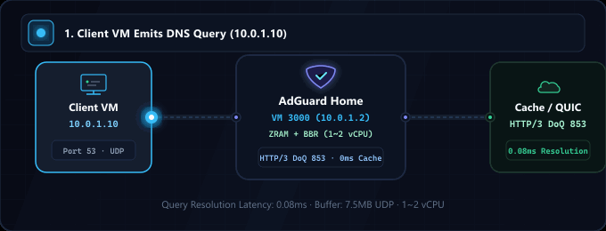
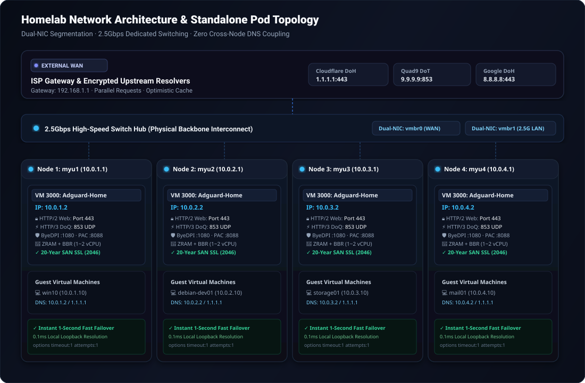

<div align="center">

<p>
  <picture>
    
  </picture>
  <picture>
    
  </picture>
</p>

# AdGuard Home High-Performance Homelab Stack

<p>
  <strong>Production-grade, hardened Zero-SPOF DNS and network appliance with ZRAM (zstd), TCP BBR, HTTP/2 &amp; HTTP/3 (QUIC/DoQ), and multi-node standalone resilience.</strong>
</p>

<p>
  <strong>🇺🇸 English</strong> ·
  <a href="locales/ko.md">🇰🇷 한국어</a> ·
  <a href="locales/zh-CN.md">🇨🇳 中文</a> ·
  <a href="locales/es.md">🇪🇸 Español</a> ·
  <a href="locales/hi.md">🇮🇳 हिन्दी</a><br />
  <a href="locales/ar.md">🇸🇦 العربية</a> ·
  <a href="locales/pt-BR.md">🇧🇷 Português</a> ·
  <a href="locales/ru.md">🇷🇺 Русский</a> ·
  <a href="locales/fr.md">🇫🇷 Français</a> ·
  <a href="locales/id.md">🇮🇩 Bahasa Indonesia</a>
</p>

<p>
  <a href="https://github.com/KS-GG-AI/adguard-homelab/releases"></a>
  <a href="LICENSE"></a>
  <a href="https://adguard.com/adguard-home.html"></a>
  
  
  
</p>

<p>
  
</p>

</div>

---

<details>
<summary><h2 style="display:inline-block; margin:0;">Architecture: External vs. Internal Networks & 2.5G Switch Hub</h2></summary>

This stack is engineered around strict **physical segmentation** and **zero-coupling pod resilience**, separating untrusted external WAN uplinks from high-bandwidth internal LAN traffic.

<p align="center">
  
</p>

### 1. 🌐 External Network (WAN / Uplink)
- **ISP Gateway Isolation**: Connected via `vmbr0` (Management & Uplink interface), shielding internal virtual machines from direct public exposure.
- **Encrypted Upstream Resolvers**: Upstream DNS queries exit over encrypted DNS-over-HTTPS (DoH) and DNS-over-TLS (DoT) to Cloudflare (`1.1.1.1`), Quad9 (`9.9.9.9`), and Google (`8.8.8.8`).
- **Parallel Queries & Optimistic Caching**: Queries run simultaneously across multiple upstreams, storing results in local memory cache to respond immediately on subsequent requests even if upstream connectivity momentarily spikes.

### 2. 🏢 Internal Network & 2.5Gbps Switch Hub (LAN & Backbone)
- **Physical 2.5G Switch Hub**: All physical hypervisor nodes (`myu1`~`myu4`) interconnect through dedicated 2.5Gbps Ethernet interfaces into a high-speed switch hub, creating a non-blocking hardware backbone.
- **Dual-NIC Segmentation**:
  - `vmbr0`: Bound to Physical NIC 1 for upstream WAN traffic and Proxmox web administration (`192.168.1.0/24`).
  - `vmbr1`: Bound to Physical NIC 2 for private internal traffic (`10.0.X.0/24`), ensuring VM-to-VM transfers never contend with hypervisor management.
- **Strict Standalone Pod Isolation (Zero Cross-Node Coupling)**:
  - Each physical mini PC runs its own local AdGuard Home appliance on **VMID 3000** (`10.0.1.2`, `10.0.2.2`, `10.0.3.2`, `10.0.4.2`).
  - **No inter-node DNS clustering**: Avoids shared quorum failures, state replication delays, and cascading outages. If Node 1 is rebooted, Nodes 2, 3, and 4 continue running with 100% operational autonomy.
- **Inter-Guest High-Speed Communication**:
  - Guest VMs (`win10`, `debian-dev01`, `mail01`, `storage01`) transfer files (Samba, NFS, SSH, databases) across the 2.5G switch hub at full 2.5Gbps line speed.
  - DNS queries are resolved on the **local node** via loopback latency (`10.0.X.2:53` UDP) in under **0.1ms**.
- **Instant 1-Second Failover**:
  - Guest VM network configurations include primary resolver `10.0.X.2` and secondary resolver `1.1.1.1` with `options timeout:1 attempts:1`. If the local AdGuard appliance is stopped for maintenance, guest traffic seamlessly fails over to public resolvers within 1 second without dropping active connections.

</details>

---

<details>
<summary><h2 style="display:inline-block; margin:0;">System Specifications: Minimum vs. Recommended</h2></summary>

| Specification | Minimum Requirements (Basic Testbed) | Recommended Specifications (Home Production) | Multi-Node Enterprise Pod (Tested) |
| :--- | :--- | :--- | :--- |
| **CPU** | 1 vCPU (x86_64 or ARM64) | 1 ~ 2 vCPU (x86_64) | Intel N100 / AMD Ryzen 5+ (Host) |
| **Memory (RAM)** | 512 MB (ZRAM enabled) | 1024 MB ~ 2048 MB | 16 GB+ Host (1024 MB dedicated per VM) |
| **Memory Tuning** | Default swap | ZRAM (zstd, swappiness 180) | ZRAM 1GB + `page-cluster 0` |
| **Disk Storage** | 8 GB Virtual Disk | 16 GB NVMe SSD | PCIe 3.0/4.0 NVMe Storage |
| **Network (NIC)** | 1x 1Gbps Ethernet | 2x 1Gbps or 2.5Gbps Dual-NIC | 2x 2.5GbE Dual-NIC + 2.5G Switch Hub |
| **Hypervisor** | Proxmox VE 7+, KVM, ESXi | Proxmox VE 8.x / Bare Metal | Proxmox VE 8.x Standalone Pods |
| **Guest OS** | Debian 12 / Ubuntu 22.04 LTS | Debian 12 (Kernel 6.1+) | Debian 12 + TCP BBR + 7.5MB UDP |

</details>

---

<details>
<summary><h2 style="display:inline-block; margin:0;">Usage Scenarios by Purpose</h2></summary>

### 1. 🏡 Smart Home & Homelab Network Shield
- Centralized, agentless ad-blocking, telemetry prevention, and anti-malware filtering for all home devices including smart TVs, mobile phones, IoT sensors, and gaming consoles.

### 2. 💻 Developer & Engineering Sandbox
- Integrated ByeDPI SOCKS5 proxy (`:1080`) and lightweight Python PAC daemon (`:8088`) for selective overseas API and documentation acceleration.
- Custom private DNS mapping for `.local`, `.lab`, and `.internal` development microservices.

### 3. 🏛️ High-Availability Virtualization (Proxmox VE / KVM)
- Tailored for multi-node homelab clusters requiring zero cascading failure risks. Independent per-node appliances ensure hypervisor maintenance on one machine never impacts the DNS health of other nodes.

### 4. 🔒 Next-Gen Encrypted Transport (DoQ / HTTP/3 & DoT)
- Replaces legacy plain-text UDP port 53 queries with encrypted **DNS-over-QUIC (HTTP/3 UDP 853)** and **DNS-over-TLS (TCP 853)**.
- Secure HTTP/2 Web dashboard on port 443 backed by automated 20-year SAN self-signed certificates for air-gapped homelabs.

</details>

---

<details>
<summary><h2 style="display:inline-block; margin:0;">Key Performance Features</h2></summary>

- **⚡ ZRAM with zstd Compression**: 1GB compressed RAM drive with `swappiness 180` and `page-cluster 0` eliminates disk I/O bottlenecks on low-memory VMs.
- **🚀 Kernel Network Tuning**: TCP BBR congestion control, FQ packet queueing, and expanded 7.5MB UDP socket buffers (`rmem_max`/`wmem_max`) prevent microburst packet drops.
- **🔒 Native HTTP/2 & HTTP/3 (QUIC / DoQ)**: Web dashboard served over HTTP/2 on port 443; DNS-over-QUIC listening on port 853 UDP.
- **🛡️ 20-Year Automated TLS**: Scripts generate 7,300-day SAN certificates valid through 2046 with zero external certificate authority renewal dependencies.
- **🔄 Transparent Port 80 Redirect**: Persistent iptables NAT rule redirects standard HTTP port 80 to 3000 without requiring port numbers in browsers.

</details>

---

<details>
<summary><h2 style="display:inline-block; margin:0;">Directory Structure</h2></summary>

```
├── configs/
│   ├── AdGuardHome.yaml.template     # Sanitized, production-tuned AdGuard config
│   ├── sysctl.d/
│   │   └── 99-adhome-tuning.conf     # Kernel, BBR, and socket buffer tuning
│   ├── systemd/
│   │   ├── zram-generator.conf       # ZRAM zstd generator configuration
│   │   ├── byedpi.service            # ByeDPI SOCKS5 systemd service
│   │   └── pac-server.service        # Python PAC server systemd service
│   ├── pac/
│   │   ├── pac_server.py             # Lightweight PAC HTTP daemon
│   │   └── proxy.pac.template        # Smart routing PAC file template
│   └── iptables/
│       └── rules.v4                  # Persistent Port 80 -> 3000 NAT redirect
├── scripts/
│   ├── setup-node.sh                 # Full automated installation script
│   ├── generate-self-signed-cert.sh  # 20-Year SAN SSL certificate generator
│   └── verify-health.sh              # System & network health check utility
├── docs/
│   ├── assets/
│   │   ├── banner.svg                # High-resolution vector banner
│   │   ├── network-topology.svg      # Multi-node network topology diagram
│   │   └── dns-flow.gif              # Real-time resolution flow animation
│   ├── ARCHITECTURE.md               # Detailed multi-node architectural design
│   ├── SECURITY.md                   # Security boundary & hardening guide
│   └── PERFORMANCE.md                # ZRAM & BBR benchmark documentation
├── LICENSE                           # MIT License
└── README.md
```

</details>

---

<details>
<summary><h2 style="display:inline-block; margin:0;">Quick Start Guide</h2></summary>

### 1. Prerequisites
- Fresh Debian 12 / 13 or Ubuntu 22.04 / 24.04 VM.
- Suggested Specs: 1 ~ 2 vCPU, 1024 MB RAM, 16 GB Disk, 2 Network Interfaces (WAN + Internal 2.5G).

### 2. Automated Node Setup
Clone the repository and run the setup script with your desired static IP:

```bash
git clone https://github.com/KS-GG-AI/adguard-homelab.git
cd adguard-homelab/scripts
chmod +x setup-node.sh generate-self-signed-cert.sh verify-health.sh

# Run setup (specify your internal IP)
sudo ./setup-node.sh 10.0.1.2
```

### 3. Verify Health & Protocols
Run the health verification utility:

```bash
sudo ./verify-health.sh 10.0.1.2
```

Expected verification:
- **ZRAM**: `/dev/zram0` active with `zstd` algorithm.
- **Sysctl**: `net.ipv4.tcp_congestion_control = bbr`, `vm.swappiness = 180`.
- **Web UI**: `HTTP/2 200/302` response on `https://10.0.1.2`.
- **DNS**: Port 53 (UDP), Port 443 (DoH), Port 853 (DoT & DoQ / HTTP/3).

</details>

---

<details>
<summary><h2 style="display:inline-block; margin:0;">Security Audit & Compliance</h2></summary>

- **Zero Hardcoded Secrets**: All passwords, bcrypt hashes, and private keys are removed and replaced with production templates.
- **Air-Gapped Capable**: 20-year certificates require zero external validation or 90-day renewal APIs.
- **Zero Inter-Node Coupling**: Physical hosts survive independently without shared quorum state.

</details>

---

<details>
<summary><h2 style="display:inline-block; margin:0;">License</h2></summary>

Released under the [MIT License](LICENSE).

</details>

---

<details>
<summary><h2 style="display:inline-block; margin:0;">📬 Contact</h2></summary>

For public work, feedback, or a closer look at the implementation, these are the clearest starting points.

[GitHub profile](https://github.com/KS-GG-AI) · [Public repositories](https://github.com/KS-GG-AI?tab=repositories) · [Open an issue](https://github.com/KS-GG-AI/adguard-homelab/issues/new) · [Profile source](https://github.com/KS-GG-AI/KS-GG-AI)

</details>
