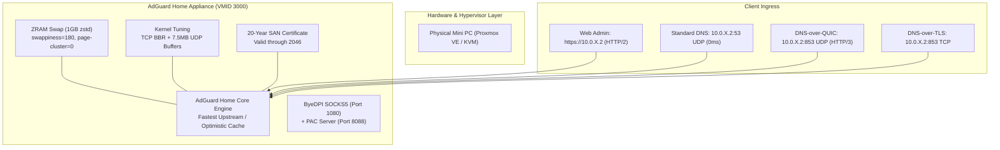

# AdGuard Home High-Performance Homelab Stack

**🇺🇸 English** · [🇰🇷 한국어](locales/ko.md) · [🇨🇳 中文](locales/zh-CN.md) · [🇪🇸 Español](locales/es.md) · [🇮🇳 हिन्दी](locales/hi.md) · [🇸🇦 العربية](locales/ar.md) · [🇧🇷 Português](locales/pt-BR.md) · [🇷🇺 Русский](locales/ru.md) · [🇫🇷 Français](locales/fr.md) · [🇮🇩 Bahasa Indonesia](locales/id.md)

[](LICENSE)
[](https://adguard.com/adguard-home.html)
[]()
[]()

Production-grade, hardened setup for running **AdGuard Home** across multi-node homelab hypervisors (e.g., Proxmox VE, KVM, Bare Metal). Features **ZRAM (zstd) memory optimization**, **Linux kernel socket buffer tuning**, **HTTP/2 Web UI & HTTP/3 (QUIC / DoQ)** support, **smart PAC proxying**, and **fast DNS failover**.

---

## Key Features

- **⚡ ZRAM with zstd Compression**: 1GB compressed RAM drive with `swappiness 180` and `page-cluster 0` to eliminate disk I/O bottlenecks in 1GB RAM VMs.
- **🚀 Kernel Network Tuning**: TCP BBR congestion control, FQ queueing, and expanded 7.5MB UDP socket buffers to absorb heavy DNS microbursts.
- **🔒 Native HTTP/2 & HTTP/3 (QUIC / DoQ)**: Web dashboard served over HTTP/2 on port 443; DNS-over-QUIC (DoQ) and DNS-over-TLS (DoT) listening on port 853.
- **🛡️ 20-Year Automated TLS**: Scripts to generate 7,300-day SAN certificates with zero external dependencies and air-gapped compatibility.
- **🔄 Transparent Port 80 Redirect**: Persistent iptables NAT rule redirecting port 80 to 3000.
- **🌐 DPI Bypass with Smart PAC**: Integrated ByeDPI SOCKS5 proxy and lightweight Python PAC server for intelligent domain routing.
- **🏛️ Standalone Resilient Pods**: Multi-node design where each physical host operates independently with 1-second fast fallback to secondary resolvers.

---

## Architecture Overview



---

## Directory Structure

```
├── configs/
│   ├── AdGuardHome.yaml.template     # Sanitized, production-tuned AdGuard config
│   ├── sysctl.d/
│   │   └── 99-adhome-tuning.conf     # Kernel, BBR, and socket buffer tuning
│   ├── systemd/
│   │   ├── zram-generator.conf       # ZRAM zstd generator configuration
│   │   ├── byedpi.service            # ByeDPI SOCKS5 systemd service
│   │   └── pac-server.service        # Python PAC server systemd service
│   ├── pac/
│   │   ├── pac_server.py             # Lightweight PAC HTTP daemon
│   │   └── proxy.pac.template        # Smart routing PAC file template
│   └── iptables/
│       └── rules.v4                  # Persistent Port 80 -> 3000 NAT redirect
├── scripts/
│   ├── setup-node.sh                 # Full automated installation script
│   ├── generate-self-signed-cert.sh  # 20-Year SAN SSL certificate generator
│   └── verify-health.sh              # System & network health check utility
├── docs/
│   ├── ARCHITECTURE.md               # Detailed multi-node architectural design
│   ├── SECURITY.md                   # Security boundary & hardening guide
│   └── PERFORMANCE.md                # ZRAM & BBR benchmark documentation
├── LICENSE                           # MIT License
└── README.md
```

---

## Quick Start Guide

### 1. Prerequisites
- Fresh Debian 12 / 13 or Ubuntu 22.04 / 24.04 VM.
- Suggested Specs: 1 vCPU, 1024 MB RAM, 16 GB Disk, 2 Network Interfaces (WAN + Internal 2.5G).

### 2. Automated Node Setup
Clone the repository and run the setup script with your desired static IP:

```bash
git clone https://github.com/KS-GG-AI/adguardhome-homelab-stack.git
cd adguardhome-homelab-stack/scripts
chmod +x setup-node.sh generate-self-signed-cert.sh verify-health.sh

# Run setup (specify your internal IP)
sudo ./setup-node.sh 10.0.1.2
```

### 3. Verify Health & Protocols
Run the health verification script:

```bash
sudo ./verify-health.sh 10.0.1.2
```

Expected output:
- **ZRAM**: `/dev/zram0` active with `zstd` algorithm.
- **Sysctl**: `net.ipv4.tcp_congestion_control = bbr`, `vm.swappiness = 180`.
- **Web UI**: `HTTP/2 200/302` response on `https://10.0.1.2`.
- **DNS**: Port 53 (UDP), Port 443 (DoH), Port 853 (DoT & DoQ / HTTP/3).

---

## Security Audit & Compliance

- **No Secrets in Repo**: All passwords, bcrypt hashes, and private keys are removed and replaced with placeholders.
- **Air-Gapped Capable**: 20-year certificates require zero external validation or 90-day renewal APIs.
- **Zero Inter-Node Coupling**: Physical hosts survive independently without shared quorum state.

---

## License

Released under the [MIT License](LICENSE).
