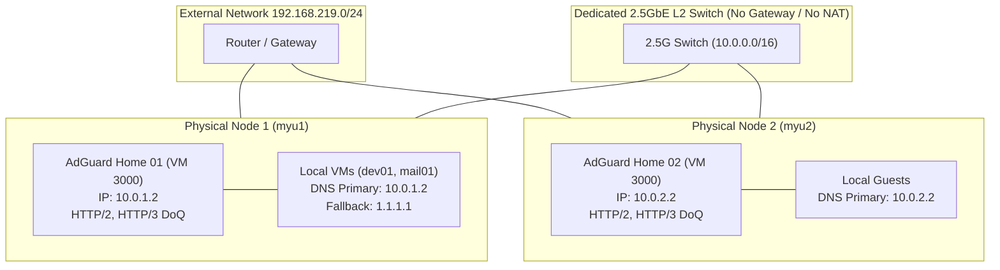

# System Architecture & Design Principles

## Overview
This architecture is built on the principle of **Zero-Single-Point-of-Failure (Zero-SPOF)** for homelab and edge deployments. Rather than clustering hypervisors into a fragile quorum (where losing 2 of 3 nodes halts the cluster), each node operates as a self-contained, standalone unit.

## Key Architectural Tenets
1. **Isolated Standalone Pods**: Each physical hypervisor runs its own dedicated AdGuard Home instance. Local guests resolve against their own physical host's AdGuard instance first.
2. **Fast Public Fallback (`timeout:1 attempts:1`)**: If a node's local AdGuard VM is stopped or undergoing maintenance, guest VMs immediately failover to secondary public resolvers within 1 second without freezing.
3. **No Cross-Node Fragility**: No node depends on another node to boot, resolve DNS, or serve network traffic.
