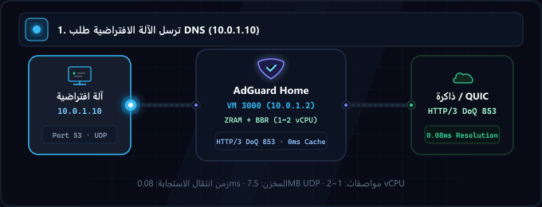
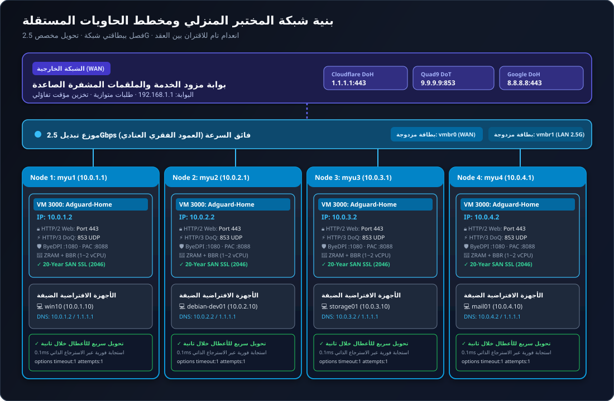

<div align="center">

<p>
  <picture>
    
  </picture>
  <picture>
    
  </picture>
</p>

# AdGuard Home: مكدس مختبر منزلي عالي الأداء

<p>
  <strong>جهاز شبكة وDNS متقدم بمواصفات بيئات الإنتاج وخالي من نقاط الفشل الفردية (Zero-SPOF) مدعوم بـ ZRAM (zstd) وTCP BBR وHTTP/2 وHTTP/3 (QUIC/DoQ) وعزل مستقل متعدد العقد.</strong>
</p>

<p>
  <a href="../README.md">🇺🇸 English</a> ·
  <a href="ko.md">🇰🇷 한국어</a> ·
  <a href="zh-CN.md">🇨🇳 中文</a> ·
  <a href="es.md">🇪🇸 Español</a> ·
  <a href="hi.md">🇮🇳 हिन्दी</a><br />
  <strong>🇸🇦 العربية</strong> ·
  <a href="pt-BR.md">🇧🇷 Português</a> ·
  <a href="ru.md">🇷🇺 Русский</a> ·
  <a href="fr.md">🇫🇷 Français</a> ·
  <a href="id.md">🇮🇩 Bahasa Indonesia</a>
</p>

<p>
  <a href="https://github.com/KS-GG-AI/adguardhome-homelab-stack/releases"></a>
  <a href="../LICENSE"></a>
  <a href="https://adguard.com/adguard-home.html"></a>
  
  
  
</p>

<p>
  
</p>

</div>

---
<div dir="rtl">


## بنية الشبكة: الشبكة الخارجية مقابل الداخلية وموزع التبديل 2.5G

تم تصميم هذه البنية بناءً على مبادئ **الفصل المادي الصارم للشبكات (Physical Segmentation)** و**عزل الحاويات المستقلة بدون اقتران (Zero-Coupling Pod Isolation)**، مما يعزل تماماً الإنترنت الخارجي غير الموثوق عن الشبكة المحلية الداخلية عالية السرعة.

<p align="center">
  
</p>

### 1. 🌐 الشبكة الخارجية (WAN / الرابط الصاعد)
- **عزل بوابة مزود الخدمة (ISP)**: الإنترنت الخارجي ومودم مزود الخدمة (192.168.1.1) يتصلان فقط عبر واجهة vmbr0 (واجهة الإدارة والرابط الصاعد)، لحماية الأجهزة الافتراضية الداخلية من التعرض المباشر للإنترنت العام.
- **تحليل DNS مشفر للملقمات الصاعدة**: تُرسل استعلامات DNS الصاعدة عبر قنوات مشفرة بتقنيات DNS-over-HTTPS (DoH) وDNS-over-TLS (DoT) إلى Cloudflare (1.1.1.1) وQuad9 (9.9.9.9) وGoogle (8.8.8.8)، مما يمنع تجسس مزود الخدمة.
- **الاستعلام المتوازي والتخزين المؤقت التفاؤلي**: يتم الاستعلام بالتوازي عبر ملقمات متعددة مع التخزين الفوري في الذاكرة العشوائية (RAM)، للاستجابة في زمن 0 ملي ثانية حتى عند حدوث تذبذب في الشبكة الخارجية.

### 2. 🏢 الشبكة الداخلية وموزع التبديل 2.5Gbps (LAN والعمود الفقري)
- **موزع تبديل مادي 2.5G (Switch Hub)**: ترتبط 4 أجهزة حاسوب صغيرة مستقلة مادية (myu1~myu4) عبر منافذ إيثرنت مخصصة بسرعة 2.5 جيجابت بموزع تبديل فائق السرعة، مشكّلة عموداً فقرياً عتادياً بدون اختناقات.
- **فصل الشبكة ببطاقتي شبكة (Dual-NIC)**: ترتبط vmbr0 ببطاقة الشبكة المادية 1 لحركة مرور WAN وإدارة Proxmox عبر الويب (192.168.1.0/24)؛ بينما ترتبط vmbr1 بالبطاقة 2 للشبكة الخاصة الداخلية (10.0.X.0/24) دون تداخل في النطاق الترددي.
- **عزل صارم ومستقل لكل عقدة (بدون اقتران أو تبعية متبادلة)**: يشغل كل حاسوب مادي نسخته الخاصة والمعزولة من AdGuard Home على المعرف VMID 3000 (10.0.X.2). لا توجد عنقدة مشتركة لـ DNS: إعادة تشغيل أو صيانة العقدة 1 لا تؤثر نهائياً على عمل العقد 2 و3 و4 بنسبة 100%.
- **اتصال فائق السرعة بين الأجهزة الافتراضية وDNS في 0 ملي ثانية**: نقل الملفات الضخمة بين الأجهزة الافتراضية (Samba, NFS, SSH, قواعد البيانات) يستغل كامل سرعة 2.5 جيجابت. بينما تتم معالجة استعلامات DNS محلياً داخل نفس الخادم عبر الاسترجاع الذاتي (10.0.X.2:53 UDP) في أقل من 0.1 ملي ثانية.
- **تبديل تلقائي فوري للأعطال خلال ثانية واحدة (Instant Failover)**: تحتوي إعدادات DNS للأجهزة الافتراضية على الخادم المحلي الأساسي 10.0.X.2 والخادم العام الاحتياطي 1.1.1.1 مع خيارات options timeout:1 attempts:1. إذا توقف AdGuard، تنتقل الحركة تلقائياً خلال ثانية واحدة دون انقطاع الاتصال.

---

## متطلبات النظام: المواصفات الدنيا مقابل الموصى بها

| المكون | المتطلبات الدنيا (بيئة اختبار بسيطة) | المواصفات الموصى بها (بيئة الإنتاج المنزلي) | عقدة مؤسسية متعددة الأجهزة (تم التحقق منها) |
| :--- | :--- | :--- | :--- |
| **المعالج (CPU)** | 1 vCPU (x86_64 أو ARM64) | 1 ~ 2 vCPU (x86_64) | Intel N100 / AMD Ryzen 5+ (خادم مادي) |
| **الذاكرة (RAM)** | 512 ميجابايت (مع تفعيل ZRAM) | 1024 ميجابايت ~ 2048 ميجابايت | 16 جيجابايت+ خادم مادي (1024 ميجابايت مخصصة لكل VM) |
| **تحسين الذاكرة** | مساحة مبادلة افتراضية على القرص | ZRAM (zstd, swappiness 180) | ZRAM 1GB + page-cluster 0 |
| **التخزين (القرص)** | قرص افتراضي 8 جيجابايت | 16 جيجابايت NVMe SSD | تخزين فائق السرعة PCIe NVMe |
| **الشبكة (NIC)** | 1x إيثرنت 1 جيجابت | 2x بطاقة شبكة مزدوجة 1G أو 2.5G | 2x 2.5GbE بطاقة مزدوجة + موزع 2.5G |
| **نظام المحاكاة الافتراضية** | Proxmox VE 7+, KVM, ESXi | Proxmox VE 8.x / عتاد مادي | عقد مستقلة على Proxmox VE 8.x |
| **نظام التشغيل الضيف** | Debian 12 / Ubuntu 22.04 LTS | Debian 12 (نواة 6.1+) | Debian 12 + TCP BBR + 7.5MB UDP |

---

## سيناريوهات الاستخدام حسب الغرض

### 1. 🏡 درع شبكة المنزل الذكي والمختبر المنزلي
- حظر مركزي شامل للإعلانات وأدوات التتبع والبرمجيات الخبيثة لجميع أجهزة المنزل (التلفزيونات الذكية، الهواتف، أجهزة IoT ومنصات الألعاب) دون الحاجة لتثبيت تطبيقات.

### 2. 💻 بيئة اختبار للمطورين والمهندسين
- بروكسي ByeDPI SOCKS5 (:1080) مدمج وخادم Python PAC (:8088) خفيف لتسريع الوصول إلى الواجهات البرمجية والتوثيقات الخارجية، مع دعم النطاقات الخاصة مثل .local و.lab و.internal.

### 3. 🏛️ بنية تحتية افتراضية عالية التوافر (Proxmox VE / KVM)
- تصميم عقد مستقلة يلغي مخاطر الأعطال المتتالية، حيث تضمن استقلالية العقد عدم تأثر الخوادم الأخرى أثناء صيانة خادم معين.

### 4. 🔒 نقل مشفر من الجيل التالي (DoQ / HTTP/3 و DoT)
- استبدال منفذ UDP 53 التقليدي غير المشفر ببروتوكولات DNS-over-QUIC (HTTP/3 UDP 853) وDNS-over-TLS (TCP 853)، مع واجهة ويب HTTP/2 وشهادات SAN صالحة لمدة 20 عاماً.

---

## أبرز ميزات الأداء

- **⚡ مبادلة الذاكرة المضغوطة ZRAM بتقنية zstd**: محرك ذاكرة مضغوط بحجم 1 جيجابايت مع إعدادات swappiness 180 وpage-cluster 0 لإلغاء اختناقات الإدخال/الإخراج.
- **🚀 ضبط مكدس شبكة النواة (Kernel)**: التحكم في الازدحام عبر TCP BBR، وجدولة طوابير FQ، وتوسيع مخازن مقابس UDP إلى 7.5 ميجابايت لمنع فقدان الحزم أثناء الذروة.
- **🔒 دعم أصيل لـ HTTP/2 و HTTP/3 (QUIC / DoQ)**: لوحة تحكم الويب تعمل عبر HTTP/2 على المنفذ 443؛ ومحرك DNS-over-QUIC يستمع على المنفذ 853 UDP.
- **🛡️ شهادات TLS آلية صالحة لمدة 20 عاماً**: توليد تلقائي لشهادات SAN صالحة لمدة 7,300 يوم حتى عام 2046 دون الاعتماد على جهات خارجية للتجديد.
- **🔄 إعادة توجيه شفافة للمنفذ 80**: قاعدة NAT دائمة في iptables تحول المنفذ 80 تلقائياً إلى 3000 دون الحاجة لكتابة رقم المنفذ في المتصفح.

---

## هيكل المجلدات

```
├── configs/
│   ├── AdGuardHome.yaml.template     # Sanitized, production-tuned AdGuard config
│   ├── sysctl.d/
│   │   └── 99-adhome-tuning.conf     # Kernel, BBR, and socket buffer tuning
│   ├── systemd/
│   │   ├── zram-generator.conf       # ZRAM zstd generator configuration
│   │   ├── byedpi.service            # ByeDPI SOCKS5 systemd service
│   │   └── pac-server.service        # Python PAC server systemd service
│   ├── pac/
│   │   ├── pac_server.py             # Lightweight PAC HTTP daemon
│   │   └── proxy.pac.template        # Smart routing PAC file template
│   └── iptables/
│       └── rules.v4                  # Persistent Port 80 -> 3000 NAT redirect
├── scripts/
│   ├── setup-node.sh                 # Full automated installation script
│   ├── generate-self-signed-cert.sh  # 20-Year SAN SSL certificate generator
│   └── verify-health.sh              # System & network health check utility
├── docs/
│   ├── assets/
│   │   ├── banner.svg                # High-resolution vector banner
│   │   ├── network-topology.svg      # Multi-node network topology diagram
│   │   └── dns-flow.gif              # Real-time resolution flow animation
│   ├── ARCHITECTURE.md               # Detailed multi-node architectural design
│   ├── SECURITY.md                   # Security boundary & hardening guide
│   └── PERFORMANCE.md                # ZRAM & BBR benchmark documentation
├── LICENSE                           # MIT License
└── README.md
```

---

## دليل البدء السريع

### 1. المتطلبات الأساسية
- جهاز افتراضي جديد يعمل بنظام Debian 12 / 13 أو Ubuntu 22.04 / 24.04.
- المواصفات الموصى بها: 1 vCPU، 1024 ميجابايت RAM، 16 جيجابايت قرص، بطاقتي شبكة (WAN + LAN 2.5G).

### 2. التثبيت الآلي للعقدة
```bash
git clone https://github.com/KS-GG-AI/adguardhome-homelab-stack.git
cd adguardhome-homelab-stack/scripts
chmod +x setup-node.sh generate-self-signed-cert.sh verify-health.sh

# تشغيل سكريبت التثبيت (مع تحديد عنوان IP الثابت الداخلي)
sudo ./setup-node.sh 10.0.1.2
```

### 3. التحقق من صحة النظام والبروتوكولات
```bash
sudo ./verify-health.sh 10.0.1.2
```

- **ZRAM**: التأكد من تشغيل /dev/zram0 بخوارزمية ضغط zstd.
- **Sysctl**: التحقق من قيم net.ipv4.tcp_congestion_control = bbr و vm.swappiness = 180.
- **Web UI**: استجابة HTTP/2 200/302 عند الدخول إلى https://10.0.1.2.
- **DNS**: المنافذ 53 (UDP) و443 (DoH) و853 (DoT & DoQ / HTTP/3) في حالة استماع نشطة.

---

## تدقيق الأمان والامتثال

- **خلو تام من الأسرار الثابتة**: تمت إزالة جميع كلمات المرور وتجزئات bcrypt والمفاتيح الخاصة وتوفيرها كقوالب آمنة.
- **دعم كامل للشبكات المعزولة (Air-Gapped)**: شهادات صالحة لمدة 20 عاماً تعمل دون الحاجة للتواصل مع واجهات تجديد خارجية كل 90 يوماً.
- **انعدام تام للاعتمادية المتبادلة بين العقد**: تعمل الأجهزة المادية باستقلالية كاملة دون الحاجة لنصاب قانوني موزع.

---

## الترخيص

مرخص بموجب [رخصة MIT](../LICENSE).

</div>