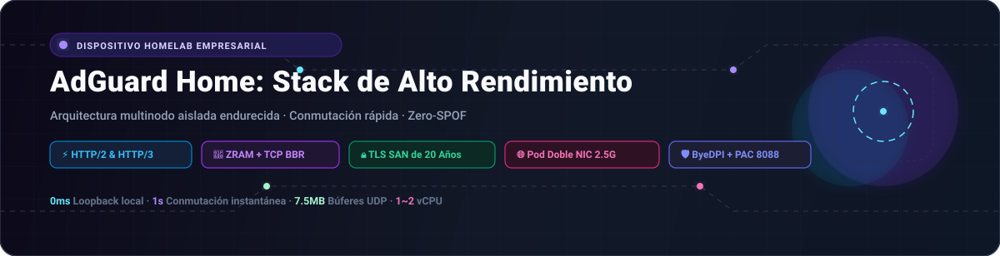
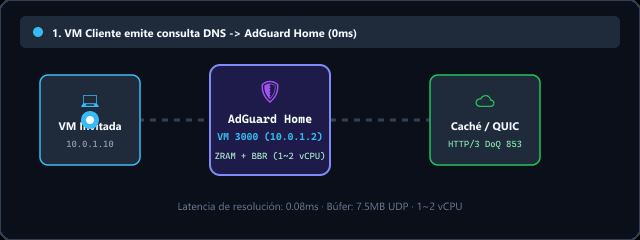
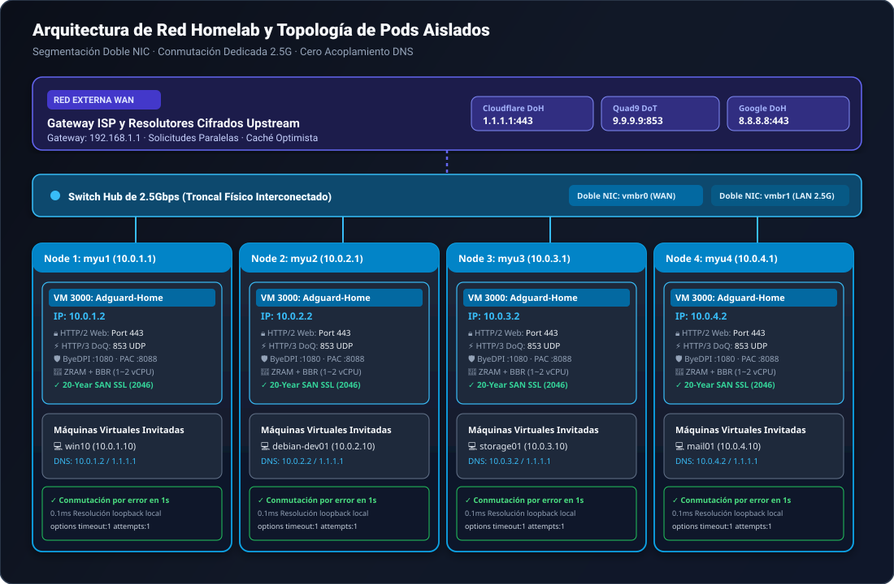

<div align="center">

<picture>
  
</picture>

# AdGuard Home: Stack de Alto Rendimiento para Homelab

<p>
  <strong>Dispositivo de red y DNS de nivel de producción Zero-SPOF con ZRAM (zstd), TCP BBR, HTTP/2 y HTTP/3 (QUIC/DoQ), y resiliencia aislada multinodo.</strong>
</p>

<p>
  <a href="../README.md">🇺🇸 English</a> ·
  <a href="ko.md">🇰🇷 한국어</a> ·
  <a href="zh-CN.md">🇨🇳 中文</a> ·
  <strong>🇪🇸 Español</strong> ·
  <a href="hi.md">🇮🇳 हिन्दी</a><br />
  <a href="ar.md">🇸🇦 العربية</a> ·
  <a href="pt-BR.md">🇧🇷 Português</a> ·
  <a href="ru.md">🇷🇺 Русский</a> ·
  <a href="fr.md">🇫🇷 Français</a> ·
  <a href="id.md">🇮🇩 Bahasa Indonesia</a>
</p>

<p>
  <a href="https://github.com/KS-GG-AI/adguardhome-homelab-stack/releases"></a>
  <a href="../LICENSE"></a>
  <a href="https://adguard.com/adguard-home.html"></a>
  
  
  
</p>

<p>
  
</p>

</div>

---

## Arquitectura de Red: Red Externa vs. Interna y Hub Switch de 2.5G

Esta arquitectura se basa en una estricta **segmentación física** y **resiliencia de nodos independientes sin acoplamiento (Zero-Coupling Pod Isolation)**, separando la red externa WAN no confiable del tráfico interno LAN de alto ancho de banda.

<p align="center">
  
</p>

### 1. 🌐 Red Externa (WAN / Enlace Ascendente)
- **Aislamiento de Gateway ISP**: La red externa y el router del ISP (192.168.1.1) se conectan únicamente mediante vmbr0 (interfaz de administración y enlace), protegiendo las máquinas virtuales invitadas de la exposición pública directa.
- **Resolución DNS Cifrada Upstream**: Las consultas DNS upstream se transmiten mediante túneles cifrados DNS-over-HTTPS (DoH) y DNS-over-TLS (DoT) hacia Cloudflare (1.1.1.1), Quad9 (9.9.9.9) y Google (8.8.8.8), bloqueando el espionaje del ISP.
- **Consultas Paralelas y Caché Optimista**: Se consultan múltiples servidores ascendentes en paralelo y se almacenan en caché en RAM, respondiendo en 0 ms de forma inmediata incluso ante fluctuaciones de la conexión externa.

### 2. 🏢 Red Interna y Switch Hub de 2.5 Gbps (LAN y Troncal)
- **Switch Hub Físico de 2.5G**: 4 mini PCs físicos independientes (myu1~myu4) se interconectan mediante interfaces Ethernet dedicadas de 2.5 Gbps a un switch hub de alta velocidad, formando una troncal de hardware sin cuellos de botella.
- **Segmentación de Red con Doble NIC**: vmbr0 se enlaza a la NIC física 1 para tráfico WAN ascendente y gestión web de Proxmox (192.168.1.0/24); vmbr1 se enlaza a la NIC física 2 para la red privada interna (10.0.X.0/24), evitando interferencias entre transferencias de VMs y administración.
- **Aislamiento Estricto de Pods Independientes (Sin Acoplamiento Inter-Nodo)**: Cada máquina física ejecuta su propio appliance de AdGuard Home en VMID 3000 (10.0.X.2). Sin clustering DNS entre nodos: el reinicio o mantenimiento del Nodo 1 no afecta en absoluto la autonomía operativa del 100% de los Nodos 2, 3 y 4.
- **Comunicación de Alta Velocidad entre VMs y Resolución DNS en 0 ms**: Las transferencias pesadas entre VMs invitadas (Samba, NFS, SSH, bases de datos) aprovechan la velocidad de línea de 2.5 Gbps. Las consultas DNS se resuelven en la máquina local vía loopback (10.0.X.2:53 UDP) en menos de 0.1 ms.
- **Conmutación por Error Instantánea de 1 Segundo (Instant Failover)**: La configuración de red de las VMs invitadas incluye el resolver primario 10.0.X.2 y secundario público 1.1.1.1 con options timeout:1 attempts:1. Si AdGuard se detiene por mantenimiento, el tráfico conmuta automáticamente en 1 segundo sin cortes.

---

## Especificaciones del Sistema: Requisitos Mínimos vs. Recomendados

| Componente | Requisitos Mínimos (Laboratorio Básico) | Especificaciones Recomendadas (Producción Homelab) | Pod Empresarial Multinodo (Validado) |
| :--- | :--- | :--- | :--- |
| **CPU** | 1 vCPU (x86_64 o ARM64) | 1 ~ 2 vCPU (x86_64) | Intel N100 / AMD Ryzen 5+ (Host físico) |
| **Memoria (RAM)** | 512 MB (con ZRAM) | 1024 MB ~ 2048 MB | 16 GB+ Host (1024 MB dedicados por VM) |
| **Optimización de Memoria** | Swap estándar en disco | ZRAM (zstd, swappiness 180) | ZRAM 1GB + page-cluster 0 |
| **Almacenamiento (Disco)** | 8 GB Disco Virtual | 16 GB NVMe SSD | Almacenamiento PCIe NVMe de alta velocidad |
| **Red (NIC)** | 1x Ethernet 1Gbps | 2x Doble NIC 1Gbps o 2.5Gbps | 2x 2.5GbE Doble NIC + Switch Hub de 2.5G |
| **Hipervisor** | Proxmox VE 7+, KVM, ESXi | Proxmox VE 8.x / Bare Metal | Pods independientes Proxmox VE 8.x |
| **SO Invitado** | Debian 12 / Ubuntu 22.04 LTS | Debian 12 (Kernel 6.1+) | Debian 12 + TCP BBR + 7.5MB UDP |

---

## Escenarios de Uso por Propósito

### 1. 🏡 Escudo de Red para Hogar Inteligente y Homelab
- Bloqueo centralizado y sin agentes de publicidad, telemetría y malware para todos los dispositivos del hogar (Smart TVs, móviles, IoT y consolas).

### 2. 💻 Entorno Sandbox para Desarrolladores e Ingeniería
- Proxy ByeDPI SOCKS5 (:1080) integrado y demonio Python PAC (:8088) ligero para aceleración de APIs y documentación internacional, con resolución privada de dominios .local, .lab e .internal.

### 3. 🏛️ Infraestructura de Virtualización de Alta Disponibilidad (Proxmox VE / KVM)
- Diseño de pods independientes sin dependencias entre nodos, garantizando que el mantenimiento de un host físico nunca afecte a los demás.

### 4. 🔒 Transporte Cifrado de Próxima Generación (DoQ / HTTP/3 y DoT)
- Sustituye las consultas UDP 53 en texto plano por DNS-over-QUIC (HTTP/3 UDP 853) y DNS-over-TLS (TCP 853), con panel web HTTP/2 y certificados SAN autorrenovables de 20 años.

---

## Características Clave de Rendimiento

- **⚡ Swap Comprimido ZRAM con zstd**: Unidad RAM comprimida de 1GB con swappiness 180 y page-cluster 0 que elimina cuellos de botella de E/S en disco.
- **🚀 Optimización del Stack de Red del Kernel**: Control de congestión TCP BBR, colas FQ y búferes de socket UDP ampliados a 7.5MB (rmem_max/wmem_max) para absorber microrráfagas.
- **🔒 HTTP/2 y HTTP/3 Nativos (QUIC / DoQ)**: Panel web servido vía HTTP/2 en puerto 443; motor DNS-over-QUIC escuchando en puerto 853 UDP.
- **🛡️ Certificados TLS Automatizados de 20 Años**: Generación automática de certificados SAN con validez de 7,300 días hasta 2046 sin dependencias de renovación externa.
- **🔄 Redirección Transparente de Puerto 80**: Regla NAT persistente de iptables que redirige automáticamente el puerto HTTP 80 a 3000.

---

## Estructura de Directorios

```
├── configs/
│   ├── AdGuardHome.yaml.template     # Sanitized, production-tuned AdGuard config
│   ├── sysctl.d/
│   │   └── 99-adhome-tuning.conf     # Kernel, BBR, and socket buffer tuning
│   ├── systemd/
│   │   ├── zram-generator.conf       # ZRAM zstd generator configuration
│   │   ├── byedpi.service            # ByeDPI SOCKS5 systemd service
│   │   └── pac-server.service        # Python PAC server systemd service
│   ├── pac/
│   │   ├── pac_server.py             # Lightweight PAC HTTP daemon
│   │   └── proxy.pac.template        # Smart routing PAC file template
│   └── iptables/
│       └── rules.v4                  # Persistent Port 80 -> 3000 NAT redirect
├── scripts/
│   ├── setup-node.sh                 # Full automated installation script
│   ├── generate-self-signed-cert.sh  # 20-Year SAN SSL certificate generator
│   └── verify-health.sh              # System & network health check utility
├── docs/
│   ├── assets/
│   │   ├── banner.svg                # High-resolution vector banner
│   │   ├── network-topology.svg      # Multi-node network topology diagram
│   │   └── dns-flow.gif              # Real-time resolution flow animation
│   ├── ARCHITECTURE.md               # Detailed multi-node architectural design
│   ├── SECURITY.md                   # Security boundary & hardening guide
│   └── PERFORMANCE.md                # ZRAM & BBR benchmark documentation
├── LICENSE                           # MIT License
└── README.md
```

---

## Guía de Inicio Rápido

### 1. Requisitos Previos
- VM limpia con Debian 12 / 13 o Ubuntu 22.04 / 24.04.
- Especificaciones sugeridas: 1 ~ 2 vCPU, 1024 MB RAM, 16 GB Disco, Doble NIC (WAN + LAN 2.5G).

### 2. Despliegue Automatizado de Nodos
```bash
git clone https://github.com/KS-GG-AI/adguardhome-homelab-stack.git
cd adguardhome-homelab-stack/scripts
chmod +x setup-node.sh generate-self-signed-cert.sh verify-health.sh

# Ejecutar instalación (especificar la IP fija interna)
sudo ./setup-node.sh 10.0.1.2
```

### 3. Verificación de Estado y Protocolos
```bash
sudo ./verify-health.sh 10.0.1.2
```

- **ZRAM**: Verificar que /dev/zram0 esté activo con compresión zstd.
- **Sysctl**: Verificar net.ipv4.tcp_congestion_control = bbr y vm.swappiness = 180.
- **Web UI**: Respuesta HTTP/2 200/302 al acceder a https://10.0.1.2.
- **DNS**: Puertos 53 (UDP), 443 (DoH) y 853 (DoT & DoQ / HTTP/3) en estado de escucha activo.

---

## Auditoría de Seguridad y Cumplimiento

- **Cero Secretos Hardcodeados**: Todas las contraseñas, hashes bcrypt y claves privadas se han eliminado y se proporcionan como plantillas seguras.
- **Apto para Entornos Aislados (Air-Gapped)**: Certificados de 20 años sin necesidad de validación externa o APIs de renovación cada 90 días.
- **Cero Acoplamiento Inter-Nodo**: Los hosts físicos operan de forma 100% independiente sin quórum compartido.

---

## Licencia

Publicado bajo la [Licencia MIT](../LICENSE).
