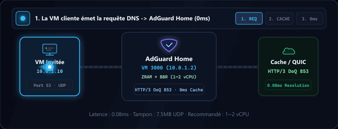
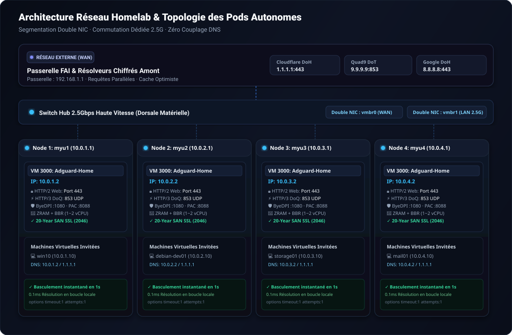

<div align="center">

<picture>
  
</picture>

# AdGuard Home : Stack Haute Performance pour Homelab

<p>
  <strong>Appliance réseau et DNS de classe production Zero-SPOF avec ZRAM (zstd), TCP BBR, HTTP/2 & HTTP/3 (QUIC/DoQ) et résilience isolée multi-nœuds.</strong>
</p>

<p>
  <a href="../README.md">🇺🇸 English</a> ·
  <a href="ko.md">🇰🇷 한국어</a> ·
  <a href="zh-CN.md">🇨🇳 中文</a> ·
  <a href="es.md">🇪🇸 Español</a> ·
  <a href="hi.md">🇮🇳 हिन्दी</a><br />
  <a href="ar.md">🇸🇦 العربية</a> ·
  <a href="pt-BR.md">🇧🇷 Português</a> ·
  <a href="ru.md">🇷🇺 Русский</a> ·
  <strong>🇫🇷 Français</strong> ·
  <a href="id.md">🇮🇩 Bahasa Indonesia</a>
</p>

<p>
  <a href="https://github.com/KS-GG-AI/adguardhome-homelab-stack/releases"></a>
  <a href="../LICENSE"></a>
  <a href="https://adguard.com/adguard-home.html"></a>
  
  
  
</p>

<p>
  
</p>

</div>

---

## Architecture Réseau : Réseau Externe vs Interne & Switch Hub 2.5G

Cette architecture repose sur une **segmentation physique** rigoureuse et une **résilience en pods indépendants sans couplage (Zero-Coupling Pod Isolation)**, isolant hermétiquement le WAN externe non sécurisé du trafic LAN privé haute vitesse.

<p align="center">
  
</p>

### 1. 🌐 Réseau Externe (WAN / Liaison Montante)
- **Isolation de la Passerelle FAI**: Le réseau externe et le routeur FAI (192.168.1.1) communiquent uniquement via vmbr0 (interface de gestion et d'accès), protégeant les VM invitées contre toute exposition publique directe.
- **Résolution DNS Chiffrée Amont**: Les requêtes DNS montantes empruntent des tunnels chiffrés DNS-over-HTTPS (DoH) et DNS-over-TLS (DoT) vers Cloudflare (1.1.1.1), Quad9 (9.9.9.9) et Google (8.8.8.8), bloquant l'espionnage du FAI.
- **Requêtes Parallèles & Cache Optimiste**: Plusieurs résolveurs amont sont interrogés simultanément et mis en cache en mémoire vive, offrant des réponses immédiates en 0 ms même en cas de latence externe.

### 2. 🏢 Réseau Interne & Switch Hub 2.5 Gbps (LAN & Cœur de Réseau)
- **Switch Hub Physique 2.5G**: 4 mini-PC physiques indépendants (myu1~myu4) sont interconnectés via des ports Ethernet 2.5 Gbps dédiés à un commutateur haute vitesse, formant une dorsale matérielle sans goulot d'étranglement.
- **Segmentation par Double Interface Réseau (Dual-NIC)**: vmbr0 est lié à la carte réseau physique 1 pour le WAN et la gestion web de Proxmox (192.168.1.0/24) ; vmbr1 est lié à la carte 2 pour le trafic privé interne (10.0.X.0/24), évitant tout conflit de bande passante.
- **Isolation Stricte des Pods (Zéro Couplage Inter-Nœuds)**: Chaque machine physique exécute sa propre appliance AdGuard Home sur le VMID 3000 (10.0.X.2). Aucun clustering DNS partagé : le redémarrage ou la maintenance du Nœud 1 n'affecte en rien les Nœuds 2, 3 et 4.
- **Communication Inter-VM Haute Vitesse & DNS en 0 ms**: Les transferts volumineux entre VM (Samba, NFS, SSH, bases de données) saturent la liaison à 2.5 Gbps réels. Les requêtes DNS sont résolues localement sur le même hôte en boucle locale (10.0.X.2:53 UDP) en moins de 0.1 ms.
- **Basculement Instantané en 1 Seconde (Instant Failover)**: La configuration réseau des VM comprend le résolveur principal 10.0.X.2 et le résolveur public de secours 1.1.1.1 avec options timeout:1 attempts:1. Si AdGuard est arrêté, le trafic bascule de manière transparente en 1 seconde sans rupture.

---

## Spécifications Système : Configuration Minimale vs Recommandée

| Composant | Configuration Minimale (Test Basique) | Spécifications Recommandées (Production Homelab) | Pod Entreprise Multi-Nœuds (Validé) |
| :--- | :--- | :--- | :--- |
| **Processeur (CPU)** | 1 vCPU (x86_64 ou ARM64) | 1 ~ 2 vCPU (x86_64) | Intel N100 / AMD Ryzen 5+ (Hôte physique) |
| **Mémoire (RAM)** | 512 Mo (avec ZRAM) | 1024 Mo ~ 2048 Mo | 16 Go+ Hôte (1024 Mo dédiés par VM) |
| **Optimisation Mémoire** | Swap standard sur disque | ZRAM (zstd, swappiness 180) | ZRAM 1Go + page-cluster 0 |
| **Stockage (Disque)** | Disque Virtuel 8 Go | 16 Go SSD NVMe | Stockage NVMe PCIe haute performance |
| **Réseau (NIC)** | 1x Ethernet 1Gbps | 2x Double NIC 1Gbps ou 2.5Gbps | 2x 2.5GbE Double NIC + Switch Hub 2.5G |
| **Hyperviseur** | Proxmox VE 7+, KVM, ESXi | Proxmox VE 8.x / Bare Metal | Pods autonomes Proxmox VE 8.x |
| **Système Invité** | Debian 12 / Ubuntu 22.04 LTS | Debian 12 (Noyau 6.1+) | Debian 12 + TCP BBR + 7.5Mo UDP |

---

## Scénarios d'Utilisation par Objectif

### 1. 🏡 Bouclier Réseau pour Maison Intelligente & Homelab
- Filtrage centralisé sans agent des publicités, traceurs et logiciels malveillants pour Smart TV, smartphones, objets connectés (IoT) et consoles de jeux.

### 2. 💻 Bac à Sable Développeur & Ingénierie
- Proxy ByeDPI SOCKS5 (:1080) et démon Python PAC (:8088) légers intégrés pour l'accélération sélective des API et documentations distantes, avec résolution de domaines privés .local, .lab et .internal.

### 3. 🏛️ Infrastructure de Virtualisation Haute Disponibilité (Proxmox VE / KVM)
- Conception en pods autonomes sans dépendance inter-machines, empêchant la propagation des pannes en cas de maintenance physique.

### 4. 🔒 Transport Chiffré de Nouvelle Génération (DoQ / HTTP/3 & DoT)
- Remplace le protocole UDP 53 en clair par DNS-over-QUIC (HTTP/3 UDP 853) et DNS-over-TLS (TCP 853), avec tableau de bord web HTTP/2 et certificats SAN valides 20 ans.

---

## Fonctionnalités Clés de Performance

- **⚡ Swap Compressé ZRAM avec zstd**: Disque RAM compressé de 1 Go avec swappiness 180 et page-cluster 0 éliminant les latences d'E/S disque.
- **🚀 Optimisation Réseau du Noyau**: Contrôle d'encombrement TCP BBR, ordonnanceur FQ et tampons de socket UDP étendus à 7.5 Mo (rmem_max/wmem_max) absorbant les micro-rafales.
- **🔒 HTTP/2 & HTTP/3 Natifs (QUIC / DoQ)**: Interface d'administration servie en HTTP/2 sur le port 443 ; moteur DNS-over-QUIC en écoute sur le port 853 UDP.
- **🛡️ Certificats TLS Automatisés Valables 20 Ans**: Génération automatique de certificats SAN d'une durée de 7 300 jours jusqu'en 2046, garantissant un fonctionnement pérenne sans autorité externe.
- **🔄 Redirection Transparente du Port 80**: Règle NAT iptables persistante redirigeant le port 80 vers 3000 sans saisie de numéro de port dans le navigateur.

---

## Structure de Répertoires

```
├── configs/
│   ├── AdGuardHome.yaml.template     # Sanitized, production-tuned AdGuard config
│   ├── sysctl.d/
│   │   └── 99-adhome-tuning.conf     # Kernel, BBR, and socket buffer tuning
│   ├── systemd/
│   │   ├── zram-generator.conf       # ZRAM zstd generator configuration
│   │   ├── byedpi.service            # ByeDPI SOCKS5 systemd service
│   │   └── pac-server.service        # Python PAC server systemd service
│   ├── pac/
│   │   ├── pac_server.py             # Lightweight PAC HTTP daemon
│   │   └── proxy.pac.template        # Smart routing PAC file template
│   └── iptables/
│       └── rules.v4                  # Persistent Port 80 -> 3000 NAT redirect
├── scripts/
│   ├── setup-node.sh                 # Full automated installation script
│   ├── generate-self-signed-cert.sh  # 20-Year SAN SSL certificate generator
│   └── verify-health.sh              # System & network health check utility
├── docs/
│   ├── assets/
│   │   ├── banner.svg                # High-resolution vector banner
│   │   ├── network-topology.svg      # Multi-node network topology diagram
│   │   └── dns-flow.gif              # Real-time resolution flow animation
│   ├── ARCHITECTURE.md               # Detailed multi-node architectural design
│   ├── SECURITY.md                   # Security boundary & hardening guide
│   └── PERFORMANCE.md                # ZRAM & BBR benchmark documentation
├── LICENSE                           # MIT License
└── README.md
```

---

## Guide de Démarrage Rapide

### 1. Prérequis
- Nouvelle machine virtuelle Debian 12 / 13 ou Ubuntu 22.04 / 24.04.
- Configuration recommandée : 1 vCPU, 1024 Mo RAM, 16 Go Disque, Double NIC (WAN + LAN 2.5G).

### 2. Déploiement Automatisé du Nœud
```bash
git clone https://github.com/KS-GG-AI/adguardhome-homelab-stack.git
cd adguardhome-homelab-stack/scripts
chmod +x setup-node.sh generate-self-signed-cert.sh verify-health.sh

# Lancer l'installation (en indiquant l'IP statique interne)
sudo ./setup-node.sh 10.0.1.2
```

### 3. Vérification de Santé et Protocoles
```bash
sudo ./verify-health.sh 10.0.1.2
```

- **ZRAM**: Vérifier que /dev/zram0 est actif avec l'algorithme zstd.
- **Sysctl**: Vérifier net.ipv4.tcp_congestion_control = bbr et vm.swappiness = 180.
- **Web UI**: Réponse HTTP/2 200/302 sur https://10.0.1.2.
- **DNS**: Ports 53 (UDP), 443 (DoH) et 853 (DoT & DoQ / HTTP/3) en écoute active.

---

## Audit de Sécurité & Conformité

- **Zéro Secret Codé en Dur**: Mots de passe, empreintes bcrypt et clés privées ont été purgés et remplacés par des modèles sécurisés.
- **Prêt pour Réseaux Déconnectés (Air-Gapped)**: Certificats de 20 ans sans requête vers des API de renouvellement trimestriel.
- **Zéro Dépendance Inter-Nœuds**: Chaque machine hôte fonctionne en totale autonomie sans quorum distribué.

---

## Licence

Distribué sous la [Licence MIT](../LICENSE).
