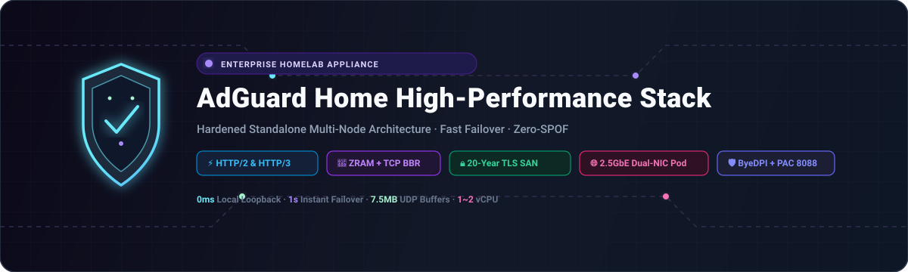

<div align="center">

<picture>
  
</picture>

# AdGuard Home: उच्च-प्रदर्शन होमलैब क्लस्टर स्टैक

<p>
  <strong>ZRAM (zstd) मेमोरी ऑप्टिमाइज़ेशन, TCP BBR, HTTP/2 और HTTP/3 (QUIC/DoQ), और मल्टी-नोड स्टैंडअलोन रेजिलिएंस के साथ प्रोडक्शन-ग्रेड Zero-SPOF DNS नेटवर्क उपकरण।</strong>
</p>

<p>
  <a href="../README.md">🇺🇸 English</a> ·
  <a href="ko.md">🇰🇷 한국어</a> ·
  <a href="zh-CN.md">🇨🇳 中文</a> ·
  <a href="es.md">🇪🇸 Español</a> ·
  <strong>🇮🇳 हिन्दी</strong><br />
  <a href="ar.md">🇸🇦 العربية</a> ·
  <a href="pt-BR.md">🇧🇷 Português</a> ·
  <a href="ru.md">🇷🇺 Русский</a> ·
  <a href="fr.md">🇫🇷 Français</a> ·
  <a href="id.md">🇮🇩 Bahasa Indonesia</a>
</p>

<p>
  <a href="https://github.com/KS-GG-AI/adguardhome-homelab-stack/releases"></a>
  <a href="../LICENSE"></a>
  <a href="https://adguard.com/adguard-home.html"></a>
  
  
  
</p>

<p>
  
</p>

</div>

---

## नेटवर्क आर्किटेक्चर: बाहरी नेटवर्क बनाम आंतरिक नेटवर्क और 2.5G स्विच हब

यह आर्किटेक्चर सख्त **भौतिक नेटवर्क विभाजन (Physical Segmentation)** और **शून्य-युग्मन स्टैंडअलोन पॉड अलगाव (Zero-Coupling Pod Isolation)** के सिद्धांतों पर निर्मित है, जो अविश्वसनीय बाहरी इंटरनेट (WAN) को उच्च-बैंडविड्थ निजी LAN से पूरी तरह अलग करता है।

<p align="center">
  
</p>

### 1. 🌐 बाहरी नेटवर्क (WAN / अपलिंक)
- **ISP गेटवे अलगाव**: बाहरी इंटरनेट और आईएसपी राउटर (192.168.1.1) केवल vmbr0 (प्रबंधन और अपलिंक इंटरफ़ेस) के माध्यम से जुड़े हैं, जिससे आंतरिक वर्चुअल मशीनें सार्वजनिक इंटरनेट पर सीधे उजागर नहीं होती हैं।
- **एन्क्रिप्टेड अपस्ट्रीम DNS रेजोल्यूशन**: अपस्ट्रीम डीएनएस क्वेरी Cloudflare (1.1.1.1), Quad9 (9.9.9.9) और Google (8.8.8.8) को एन्क्रिप्टेड DNS-over-HTTPS (DoH) और DNS-over-TLS (DoT) सुरंगों के माध्यम से भेजी जाती हैं, जो आईएसपी स्नूपिंग को रोकती हैं।
- **समानांतर क्वेरी और आशावादी कैशिंग**: एकाधिक अपस्ट्रीम सर्वरों से एक साथ क्वेरी की जाती है और रैम कैश में त्वरित रूप से संग्रहीत की जाती है, जो बाहरी नेटवर्क में उतार-चढ़ाव होने पर भी 0ms में तत्काल प्रतिक्रिया देती है।

### 2. 🏢 आंतरिक नेटवर्क और 2.5Gbps स्विच हब (LAN और बैकबोन)
- **भौतिक 2.5G स्विच हब कोर**: 4 स्वतंत्र भौतिक मिनी पीसी (myu1~myu4) 2.5Gbps समर्पित ईथरनेट पोर्ट के माध्यम से एक उच्च-गति स्विच हब से जुड़े हैं, जो बिना किसी बाधा के एक हार्डवेयर बैकबोन बनाते हैं।
- **ड्यूल-एनआईसी नेटवर्क पृथक्करण**: vmbr0 भौतिक एनआईसी 1 से जुड़ा है जो WAN और Proxmox वेब प्रबंधन (192.168.1.0/24) संभालता है; vmbr1 भौतिक एनआईसी 2 से जुड़ा है जो आंतरिक निजी नेटवर्क (10.0.X.0/24) को संभालता है।
- **सख्त स्टैंडअलोन पॉड अलगाव (शून्य क्रॉस-नोड निर्भरता)**: प्रत्येक भौतिक मशीन VMID 3000 (10.0.X.2) पर अपना स्वतंत्र AdGuard Home उपकरण चलाती है। कोई इंटर-नोड DNS क्लस्टरिंग नहीं: नोड 1 के रीबूट या रखरखाव से नोड्स 2, 3 और 4 की 100% परिचालन स्वायत्तता प्रभावित नहीं होती है।
- **वीएम के बीच उच्च-गति संचार और 0ms DNS रेजोल्यूशन**: अतिथि वीएम (Samba, NFS, SSH, डेटाबेस) 2.5 Gbps की पूरी लाइन गति पर डेटा स्थानांतरित करते हैं। डीएनएस क्वेरी स्थानीय मशीन में लूपबैक (10.0.X.2:53 UDP) द्वारा 0.1ms से कम में हल की जाती हैं।
- **तत्काल 1-सेकंड ऑटो फेलओवर (Instant Failover)**: अतिथि वीएम कॉन्फ़िगरेशन में प्राथमिक डीएनएस 10.0.X.2 और द्वितीयक सार्वजनिक डीएनएस 1.1.1.1 के साथ options timeout:1 attempts:1 शामिल है। यदि AdGuard बंद हो जाता है, तो ट्रैफ़िक बिना कनेक्शन टूटे 1 सेकंड में बैकअप पर स्विच हो जाता है।

---

## सिस्टम आवश्यकताएँ: न्यूनतम बनाम अनुशंसित विनिर्देश

| घटक | न्यूनतम आवश्यकताएँ (मूल परीक्षण वातावरण) | अनुशंसित विनिर्देश (होम प्रोडक्शन) | एंटरप्राइज मल्टी-नोड पॉड (सत्यापित) |
| :--- | :--- | :--- | :--- |
| **सीपीयू (CPU)** | 1 vCPU (x86_64 या ARM64) | 2 vCPU (x86_64) | Intel N100 / AMD Ryzen 5+ (भौतिक होस्ट) |
| **मेमोरी (RAM)** | 512 MB (ZRAM सक्षम) | 1024 MB ~ 2048 MB | 16 GB+ होस्ट (प्रति वीएम 1024 MB समर्पित) |
| **मेमोरी ऑप्टिमाइज़ेशन** | मानक डिस्क स्वैप | ZRAM (zstd, swappiness 180) | ZRAM 1GB + page-cluster 0 |
| **स्टोरेज (डिस्क)** | 8 GB वर्चुअल डिस्क | 16 GB NVMe SSD | PCIe NVMe उच्च-गति स्टोरेज |
| **नेटवर्क (NIC)** | 1x 1Gbps ईथरनेट | 2x 1Gbps या 2.5Gbps ड्यूल-एनआईसी | 2x 2.5GbE ड्यूल-एनआईसी + 2.5G स्विच हब |
| **हाइपरवाइजर** | Proxmox VE 7+, KVM, ESXi | Proxmox VE 8.x / बेयर मेटल | Proxmox VE 8.x स्वतंत्र पॉड्स |
| **अतिथि ओएस** | Debian 12 / Ubuntu 22.04 LTS | Debian 12 (कर्नेल 6.1+) | Debian 12 + TCP BBR + 7.5MB UDP |

---

## उद्देश्य अनुसार उपयोग परिदृश्य

### 1. 🏡 स्मार्ट होम और होमलैब नेटवर्क सुरक्षा ढाल
- स्मार्ट टीवी, स्मार्टफोन, IoT और गेमिंग कंसोल सहित सभी उपकरणों के लिए बिना ऐप इंस्टॉल किए विज्ञापन, ट्रैकिंग और मैलवेयर का केंद्रीकृत ब्लॉक।

### 2. 💻 डेवलपर और इंजीनियरिंग सैंडबॉक्स
- विदेशी एपीआई और दस्तावेज़ों के त्वरित उपयोग के लिए एकीकृत ByeDPI SOCKS5 (:1080) और हल्का Python PAC (:8088) डेमॉन, साथ ही .local, .lab और .internal डोमेन के लिए कस्टम DNS मैपिंग।

### 3. 🏛️ उच्च-उपलब्धता वर्चुअलाइजेशन (Proxmox VE / KVM)
- नोड्स के बीच निर्भरता को समाप्त करने वाला स्वतंत्र पॉड डिज़ाइन यह सुनिश्चित करता है कि एक भौतिक मशीन का रखरखाव अन्य मशीनों को कभी प्रभावित न करे।

### 4. 🔒 अगली पीढ़ी का एन्क्रिप्टेड ट्रांसपोर्ट (DoQ / HTTP/3 और DoT)
- पुराने प्लेन-टेक्स्ट UDP 53 को DNS-over-QUIC (HTTP/3 UDP 853) और DNS-over-TLS (TCP 853) से बदलें, साथ ही HTTP/2 वेब डैशबोर्ड और 20-वर्षीय SAN प्रमाणपत्र।

---

## प्रमुख प्रदर्शन विशेषताएँ

- **⚡ zstd कम्प्रेशन के साथ ZRAM स्वैप**: swappiness 180 और page-cluster 0 के साथ 1GB संपीड़ित रैम ड्राइव जो डिस्क I/O बाधाओं को समाप्त करती है।
- **🚀 कर्नेल नेटवर्क स्टैक ट्यूनिंग**: TCP BBR कंजेशन कंट्रोल, FQ शेड्यूलिंग और विस्तारित 7.5MB UDP सॉकेट बफ़र्स (rmem_max/wmem_max) पैकेट ड्रॉप को रोकते हैं।
- **🔒 नेटिव HTTP/2 और HTTP/3 (QUIC / DoQ)**: पोर्ट 443 पर HTTP/2 समर्थित वेब डैशबोर्ड; पोर्ट 853 UDP पर DNS-over-QUIC लिसनिंग।
- **🛡️ स्वचालित 20-वर्षीय TLS प्रमाणपत्र**: स्क्रिप्ट द्वारा स्वचालित रूप से 7,300 दिनों (2046 तक) के लिए वैध SAN प्रमाणपत्र उत्पन्न किए जाते हैं।
- **🔄 पारदर्शी पोर्ट 80 रीडायरेक्ट**: स्थायी iptables NAT नियम जो ब्राउज़र में पोर्ट नंबर डाले बिना पोर्ट 80 को पोर्ट 3000 पर रीडायरेक्ट करता है।

---

## निर्देशिका संरचना

```
├── configs/
│   ├── AdGuardHome.yaml.template     # Sanitized, production-tuned AdGuard config
│   ├── sysctl.d/
│   │   └── 99-adhome-tuning.conf     # Kernel, BBR, and socket buffer tuning
│   ├── systemd/
│   │   ├── zram-generator.conf       # ZRAM zstd generator configuration
│   │   ├── byedpi.service            # ByeDPI SOCKS5 systemd service
│   │   └── pac-server.service        # Python PAC server systemd service
│   ├── pac/
│   │   ├── pac_server.py             # Lightweight PAC HTTP daemon
│   │   └── proxy.pac.template        # Smart routing PAC file template
│   └── iptables/
│       └── rules.v4                  # Persistent Port 80 -> 3000 NAT redirect
├── scripts/
│   ├── setup-node.sh                 # Full automated installation script
│   ├── generate-self-signed-cert.sh  # 20-Year SAN SSL certificate generator
│   └── verify-health.sh              # System & network health check utility
├── docs/
│   ├── assets/
│   │   ├── banner.svg                # High-resolution vector banner
│   │   ├── network-topology.svg      # Multi-node network topology diagram
│   │   └── dns-flow.gif              # Real-time resolution flow animation
│   ├── ARCHITECTURE.md               # Detailed multi-node architectural design
│   ├── SECURITY.md                   # Security boundary & hardening guide
│   └── PERFORMANCE.md                # ZRAM & BBR benchmark documentation
├── LICENSE                           # MIT License
└── README.md
```

---

## त्वरित आरंभ गाइड

### 1. पूर्वापेक्षाएँ
- नया Debian 12 / 13 या Ubuntu 22.04 / 24.04 वर्चुअल मशीन।
- अनुशंसित विनिर्देश: 1 vCPU, 1024 MB RAM, 16 GB डिस्क, ड्यूल एनआईसी (WAN + आंतरिक 2.5G)।

### 2. स्वचालित नोड परिनियोजन
```bash
git clone https://github.com/KS-GG-AI/adguardhome-homelab-stack.git
cd adguardhome-homelab-stack/scripts
chmod +x setup-node.sh generate-self-signed-cert.sh verify-health.sh

# स्थापना निष्पादित करें (आंतरिक स्थिर आईपी निर्दिष्ट करें)
sudo ./setup-node.sh 10.0.1.2
```

### 3. स्वास्थ्य और प्रोटोकॉल सत्यापन
```bash
sudo ./verify-health.sh 10.0.1.2
```

- **ZRAM**: सत्यापित करें कि /dev/zram0 zstd कम्प्रेशन के साथ सक्रिय है।
- **Sysctl**: net.ipv4.tcp_congestion_control = bbr और vm.swappiness = 180 सत्यापित करें।
- **Web UI**: https://10.0.1.2 पर HTTP/2 200/302 प्रतिक्रिया की पुष्टि करें।
- **DNS**: पोर्ट 53 (UDP), 443 (DoH) और 853 (DoT & DoQ / HTTP/3) सक्रिय लिसनिंग स्थिति में हैं।

---

## सुरक्षा ऑडिट और अनुपालन

- **शून्य हार्डकोडेड सीक्रेट्स**: सभी पासवर्ड, bcrypt हैश और निजी कुंजियाँ हटा दी गई हैं और सुरक्षित टेम्प्लेट प्रदान किए गए हैं।
- **पूर्णतः पृथक नेटवर्क समर्थन (Air-Gapped)**: 20-वर्षीय प्रमाणपत्र बाहरी 90-दिवसीय नवीनीकरण एपीआई के बिना स्थायी रूप से कार्य करते हैं।
- **शून्य अंतर-नोड युग्मन**: भौतिक होस्ट बिना किसी साझा कोरम के पूरी तरह स्वतंत्र रूप से कार्य करते हैं।

---

## लाइसेंस

[MIT लाइसेंस](../LICENSE) के तहत जारी किया गया।
