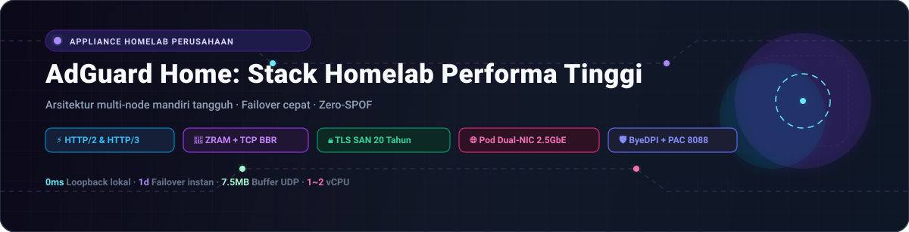
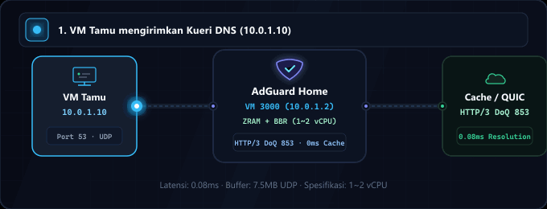
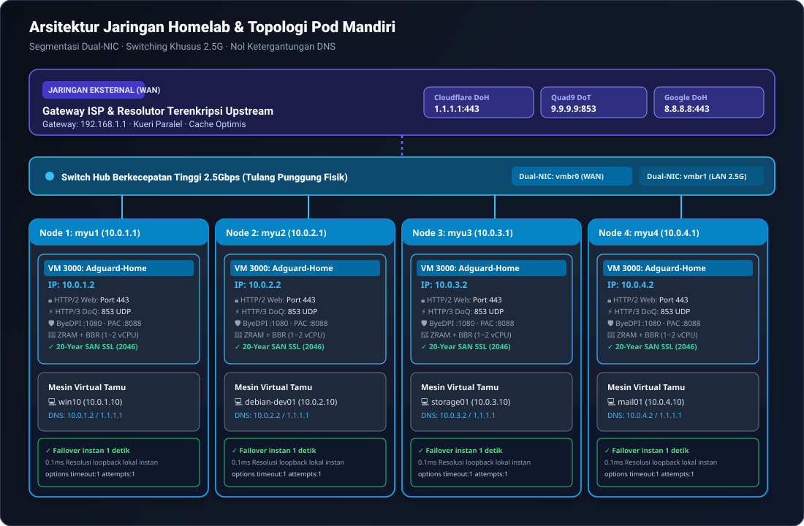

<div align="center">

<p>
  <picture>
    
  </picture>
  <picture>
    
  </picture>
</p>

# AdGuard Home: Stack Homelab Performa Tinggi

<p>
  <strong>Appliance jaringan dan DNS tingkat produksi Zero-SPOF dengan optimasi ZRAM (zstd), TCP BBR, HTTP/2 & HTTP/3 (QUIC/DoQ), dan ketahanan terisolasi multi-node.</strong>
</p>

<p>
  <a href="../README.md">🇺🇸 English</a> ·
  <a href="ko.md">🇰🇷 한국어</a> ·
  <a href="zh-CN.md">🇨🇳 中文</a> ·
  <a href="es.md">🇪🇸 Español</a> ·
  <a href="hi.md">🇮🇳 हिन्दी</a><br />
  <a href="ar.md">🇸🇦 العربية</a> ·
  <a href="pt-BR.md">🇧🇷 Português</a> ·
  <a href="ru.md">🇷🇺 Русский</a> ·
  <a href="fr.md">🇫🇷 Français</a> ·
  <strong>🇮🇩 Bahasa Indonesia</strong>
</p>

<p>
  <a href="https://github.com/KS-GG-AI/adguard-homelab/releases"></a>
  <a href="../LICENSE"></a>
  <a href="https://adguard.com/adguard-home.html"></a>
  
  
  
</p>

<p>
  
</p>

</div>

---

<details>
<summary><h2 style="display:inline-block; margin:0;">Arsitektur Jaringan: Jaringan Eksternal vs Internal & Switch Hub 2.5G</h2></summary>

Arsitektur ini dibangun berdasarkan prinsip **segmentasi fisik** yang ketat dan **ketahanan pod independen tanpa kopling (Zero-Coupling Pod Isolation)**, memisahkan lalu lintas uplink WAN eksternal yang tidak tepercaya dari lalu lintas LAN internal berkecepatan tinggi.

<p align="center">
  
</p>

### 1. 🌐 Jaringan Eksternal (WAN / Uplink)
- **Isolasi Gateway ISP**: Jaringan eksternal dan modem ISP (192.168.1.1) hanya terhubung melalui vmbr0 (antarmuka manajemen & uplink), melindungi VM tamu dari paparan langsung ke internet publik.
- **Resolusi DNS Terenkripsi ke Upstream**: Kueri DNS upstream dikirimkan melalui terowongan terenkripsi DNS-over-HTTPS (DoH) dan DNS-over-TLS (DoT) ke Cloudflare (1.1.1.1), Quad9 (9.9.9.9), dan Google (8.8.8.8), mencegah penyadapan ISP.
- **Kueri Paralel & Cache Optimis**: Kueri dikirim secara bersamaan ke beberapa server upstream dan disimpan dalam cache RAM, memberikan respons 0 md instan bahkan ketika koneksi eksternal mengalami gangguan.

### 2. 🏢 Jaringan Internal & Switch Hub 2.5 Gbps (LAN & Backbone)
- **Switch Hub Fisik 2.5G**: 4 unit mini PC fisik independen (myu1~myu4) terhubung langsung via port Ethernet 2.5 Gbps ke switch hub berkecepatan tinggi, membentuk tulang punggung perangkat keras tanpa bottleneck.
- **Segmentasi Kartu Jaringan Ganda (Dual-NIC)**: vmbr0 terhubung ke NIC fisik 1 untuk WAN dan manajemen web Proxmox (192.168.1.0/24); vmbr1 terhubung ke NIC fisik 2 untuk jaringan internal privat (10.0.X.0/24), menjaga transfer antar-VM agar tidak mengganggu manajemen hipervisor.
- **Isolasi Pod Mandiri Ketat (Nol Ketergantungan Antar-Node)**: Setiap PC fisik menjalankan instans AdGuard Home sendiri pada VMID 3000 (10.0.X.2). Tanpa kluster DNS antar-node: pemeliharaan atau reboot pada Node 1 sama sekali tidak memengaruhi otonomi operasional 100% pada Node 2, 3, dan 4.
- **Komunikasi VM Kecepatan Tinggi & DNS 0 md**: Transfer file berkapasitas besar antar-VM tamu (Samba, NFS, SSH, database) berjalan pada kecepatan penuh 2.5 Gbps. Kueri DNS diselesaikan secara lokal di host yang sama melalui loopback (10.0.X.2:53 UDP) dalam waktu kurang dari 0.1 md.
- **Failover Otomatis Instan 1 Detik (Instant Failover)**: Konfigurasi jaringan VM menyertakan DNS primer 10.0.X.2 dan DNS publik sekunder 1.1.1.1 dengan opsi options timeout:1 attempts:1. Jika AdGuard mati, lalu lintas beralih otomatis dalam 1 detik tanpa pemutusan koneksi.

</details>

---

<details>
<summary><h2 style="display:inline-block; margin:0;">Spesifikasi Sistem: Persyaratan Minimum vs Rekomendasi</h2></summary>

| Komponen | Persyaratan Minimum (Lingkungan Uji Coba) | Spesifikasi Rekomendasi (Produksi Homelab) | Pod Perusahaan Multi-Node (Teruji) |
| :--- | :--- | :--- | :--- |
| **CPU** | 1 vCPU (x86_64 atau ARM64) | 1 ~ 2 vCPU (x86_64) | Intel N100 / AMD Ryzen 5+ (Host Fisik) |
| **Memori (RAM)** | 512 MB (dengan ZRAM) | 1024 MB ~ 2048 MB | 16 GB+ Host (1024 MB khusus per VM) |
| **Optimasi Memori** | Swap disk standar | ZRAM (zstd, swappiness 180) | ZRAM 1GB + page-cluster 0 |
| **Penyimpanan (Disk)** | 8 GB Disk Virtual | 16 GB NVMe SSD | Penyimpanan Cepat PCIe NVMe |
| **Jaringan (NIC)** | 1x 1Gbps Ethernet | 2x 1Gbps atau 2.5Gbps Dual-NIC | 2x 2.5GbE Dual-NIC + Switch Hub 2.5G |
| **Hypervisor** | Proxmox VE 7+, KVM, ESXi | Proxmox VE 8.x / Bare Metal | Pod Mandiri Proxmox VE 8.x |
| **Sistem Operasi Tamu** | Debian 12 / Ubuntu 22.04 LTS | Debian 12 (Kernel 6.1+) | Debian 12 + TCP BBR + 7.5MB UDP |

</details>

---

<details>
<summary><h2 style="display:inline-block; margin:0;">Skenario Penggunaan Berdasarkan Kebutuhan</h2></summary>

### 1. 🏡 Pelindung Jaringan Smart Home & Homelab
- Pemblokiran iklan, telemetri, dan malware terpusat tanpa perlu memasang aplikasi di setiap perangkat (Smart TV, ponsel, sensor IoT, dan konsol game).

### 2. 💻 Lingkungan Sandbox Pengembang & Rekayasa Perangkat Lunak
- Dilengkapi proxy ByeDPI SOCKS5 (:1080) dan daemon Python PAC (:8088) ringan untuk akselerasi akses dokumentasi dan API global, serta pemetaan domain privat .local, .lab, dan .internal.

### 3. 🏛️ Infrastruktur Virtualisasi Ketersediaan Tinggi (Proxmox VE / KVM)
- Desain pod independen tanpa ketergantungan antar-mesin memastikan pemeliharaan satu host tidak pernah melumpuhkan jaringan node lainnya.

### 4. 🔒 Transportasi Terenkripsi Generasi Baru (DoQ / HTTP/3 & DoT)
- Menggantikan protokol UDP 53 teks biasa dengan DNS-over-QUIC (HTTP/3 UDP 853) dan DNS-over-TLS (TCP 853), dilengkapi dasbor web HTTP/2 dan sertifikat SAN 20 tahun.

</details>

---

<details>
<summary><h2 style="display:inline-block; margin:0;">Fitur Performa Utama</h2></summary>

- **⚡ Swap Terkompresi ZRAM dengan zstd**: Drive RAM terkompresi 1GB dengan swappiness 180 dan page-cluster 0 yang meniadakan hambatan I/O disk.
- **🚀 Penyetelan Jaringan Kernel Linux**: Kontrol kemacetan TCP BBR, penjadwalan antrean FQ, dan buffer soket UDP yang diperluas hingga 7.5MB (rmem_max/wmem_max) untuk menangani lonjakan kueri.
- **🔒 HTTP/2 & HTTP/3 Native (QUIC / DoQ)**: Dasbor web beroperasi melalui HTTP/2 di port 443; mesin DNS-over-QUIC mendengarkan di port 853 UDP.
- **🛡️ Sertifikat TLS Otomatis Berdurasi 20 Tahun**: Skrip otomatis menghasilkan sertifikat SAN 7.300 hari hingga tahun 2046 tanpa memerlukan perpanjangan dari CA publik eksternal.
- **🔄 Pengalihan Port 80 Transparan**: Aturan NAT iptables persisten mengalihkan lalu lintas port HTTP 80 ke 3000 tanpa perlu mengetikkan nomor port di browser.

</details>

---

<details>
<summary><h2 style="display:inline-block; margin:0;">Struktur Direktori</h2></summary>

```
├── configs/
│   ├── AdGuardHome.yaml.template     # Sanitized, production-tuned AdGuard config
│   ├── sysctl.d/
│   │   └── 99-adhome-tuning.conf     # Kernel, BBR, and socket buffer tuning
│   ├── systemd/
│   │   ├── zram-generator.conf       # ZRAM zstd generator configuration
│   │   ├── byedpi.service            # ByeDPI SOCKS5 systemd service
│   │   └── pac-server.service        # Python PAC server systemd service
│   ├── pac/
│   │   ├── pac_server.py             # Lightweight PAC HTTP daemon
│   │   └── proxy.pac.template        # Smart routing PAC file template
│   └── iptables/
│       └── rules.v4                  # Persistent Port 80 -> 3000 NAT redirect
├── scripts/
│   ├── setup-node.sh                 # Full automated installation script
│   ├── generate-self-signed-cert.sh  # 20-Year SAN SSL certificate generator
│   └── verify-health.sh              # System & network health check utility
├── docs/
│   ├── assets/
│   │   ├── banner.svg                # High-resolution vector banner
│   │   ├── network-topology.svg      # Multi-node network topology diagram
│   │   └── dns-flow.gif              # Real-time resolution flow animation
│   ├── ARCHITECTURE.md               # Detailed multi-node architectural design
│   ├── SECURITY.md                   # Security boundary & hardening guide
│   └── PERFORMANCE.md                # ZRAM & BBR benchmark documentation
├── LICENSE                           # MIT License
└── README.md
```

</details>

---

<details>
<summary><h2 style="display:inline-block; margin:0;">Panduan Memulai Cepat</h2></summary>

### 1. Prasyarat
- VM baru dengan Debian 12 / 13 atau Ubuntu 22.04 / 24.04.
- Spesifikasi yang disarankan: 1 ~ 2 vCPU, 1024 MB RAM, 16 GB Disk, Kartu Jaringan Ganda (WAN + LAN 2.5G).

### 2. Instalasi Node Otomatis
```bash
git clone https://github.com/KS-GG-AI/adguard-homelab.git
cd adguard-homelab/scripts
chmod +x setup-node.sh generate-self-signed-cert.sh verify-health.sh

# Jalankan instalasi (tentukan alamat IP statis internal)
sudo ./setup-node.sh 10.0.1.2
```

### 3. Verifikasi Kesehatan dan Protokol
```bash
sudo ./verify-health.sh 10.0.1.2
```

- **ZRAM**: Pastikan /dev/zram0 aktif dengan algoritma zstd.
- **Sysctl**: Verifikasi net.ipv4.tcp_congestion_control = bbr dan vm.swappiness = 180.
- **Web UI**: Mendapatkan respons HTTP/2 200/302 saat mengakses https://10.0.1.2.
- **DNS**: Port 53 (UDP), 443 (DoH), dan 853 (DoT & DoQ / HTTP/3) berada dalam status mendengarkan aktif.

</details>

---

<details>
<summary><h2 style="display:inline-block; margin:0;">Audit Keamanan dan Kepatuhan</h2></summary>

- **Nol Rahasia Hardcode**: Semua kata sandi, hash bcrypt, dan kunci privat telah dibersihkan dan disediakan sebagai templat aman.
- **Mendukung Jaringan Terisolasi (Air-Gapped)**: Sertifikat 20 tahun berfungsi penuh tanpa memerlukan API perpanjangan berkala 90 hari.
- **Nol Ketergantungan Antar-Node**: Host fisik beroperasi secara mandiri tanpa memerlukan mekanisme kuorum bersama.

</details>

---

<details>
<summary><h2 style="display:inline-block; margin:0;">Lisensi</h2></summary>

Dirilis di bawah naungan [Lisensi MIT](../LICENSE).

</details>

---

<details>
<summary><h2 style="display:inline-block; margin:0;">📬 Kontak</h2></summary>

Untuk pekerjaan publik, masukan, atau melihat implementasi lebih dekat, tautan berikut adalah titik awal yang paling jelas.

[Profil GitHub](https://github.com/KS-GG-AI) · [Repositori publik](https://github.com/KS-GG-AI?tab=repositories) · [Buka issue](https://github.com/KS-GG-AI/adguard-homelab/issues/new) · [Sumber profil](https://github.com/KS-GG-AI/KS-GG-AI)

</details>
