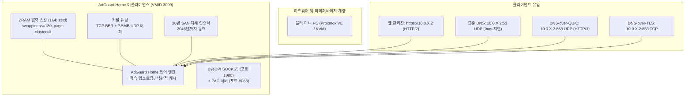

# AdGuard Home 고성능 홈랩 클러스터 스택

[🇺🇸 English](../README.md) · **🇰🇷 한국어** · [🇨🇳 中文](zh-CN.md) · [🇪🇸 Español](es.md) · [🇮🇳 हिन्दी](hi.md) · [🇸🇦 العربية](ar.md) · [🇧🇷 Português](pt-BR.md) · [🇷🇺 Русский](ru.md) · [🇫🇷 Français](fr.md) · [🇮🇩 Bahasa Indonesia](id.md)

[](../LICENSE)
[](https://adguard.com/adguard-home.html)
[]()
[]()

멀티 노드 하이퍼바이저(Proxmox VE, KVM, 베어메탈 등) 환경에서 **AdGuard Home**을 최고 성능으로 운영하기 위한 프로덕션급 하드닝 구성입니다. **ZRAM(zstd) 메모리 압축 최적화**, **리눅스 커널 소켓 버퍼 튜닝**, **HTTP/2 웹 UI 및 HTTP/3(QUIC / DoQ)** 지원, **스마트 PAC 프록시**, 그리고 **초고속 장애 조치(Fast DNS Failover)** 기능을 제공합니다.

---

## 주요 기능

- **⚡ ZRAM zstd 압축 스왑**: 1GB 저용량 VM에서도 디스크 I/O 병목을 제거하는 `swappiness 180`, `page-cluster 0` 기반 1GB 압축 램 드라이브.
- **🚀 커널 네트워크 최적화**: 대용량 DNS 마이크로버스트 패킷 손실을 방지하는 TCP BBR 혼잡 제어, FQ 스케줄러, 7.5MB UDP 수신/송신 버퍼 확장.
- **🔒 네이티브 HTTP/2 및 HTTP/3 (QUIC / DoQ)**: 포트 443(HTTPS) 웹 관리창 HTTP/2 멀티플렉싱 및 포트 853(UDP) 차세대 DNS-over-QUIC(DoQ) 엔진 기본 가동.
- **🛡️ 20년 장기 자체 SSL 인증서**: 외부 도메인이나 90일 주기 갱신 없이 완전한 폐쇄망에서도 영구 동작하는 7,300일 SAN 인증서 자동 발급 스크립트.
- **🔄 투명 80 포트 리다이렉트**: 포트 번호(:3000) 입력 없이 `http://<IP>`로 접속 가능한 iptables 영구 포워딩.
- **🌐 DPI 우회 및 스마트 PAC**: ByeDPI SOCKS5 프록시와 초경량 Python PAC 데몬 연동으로 차단 사이트 선별 우회.
- **🏛️ 단독 노드 무중단 아키텍처**: 정족수(Quorum) 결합 없이 각 물리 PC가 독립 동작하며, 로컬 AdGuard 장애 시 1초 만에 공용 DNS로 자동 전환되는 Zero-SPOF 구조.

---

## 아키텍처 개요



---

## 빠른 시작 가이드

### 1. 사전 요구사항
- Debian 12 / 13 또는 Ubuntu 22.04 / 24.04 VM.
- 권장 사양: 1 vCPU, 1024 MB RAM, 16 GB 디스크, 듀얼 NIC(외부망 + 내부 2.5G).

### 2. 자동 노드 셋업
저장소를 클론하고 부여할 사설 고정 IP를 지정하여 스크립트를 실행합니다:

```bash
git clone https://github.com/KS-GG-AI/adguardhome-homelab-stack.git
cd adguardhome-homelab-stack/scripts
chmod +x setup-node.sh generate-self-signed-cert.sh verify-health.sh

# 셋업 실행 (할당할 내부 IP 지정)
sudo ./setup-node.sh 10.0.1.2
```

### 3. 상태 검증
자가 진단 스크립트로 동작 상태를 즉시 점검합니다:

```bash
sudo ./verify-health.sh 10.0.1.2
```

---

## 라이선스

[MIT License](../LICENSE)에 따라 자유롭게 사용 및 수정이 가능합니다.
