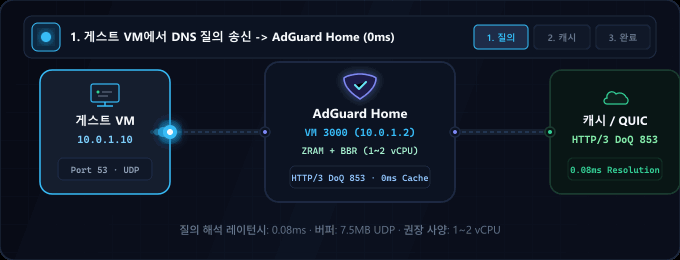
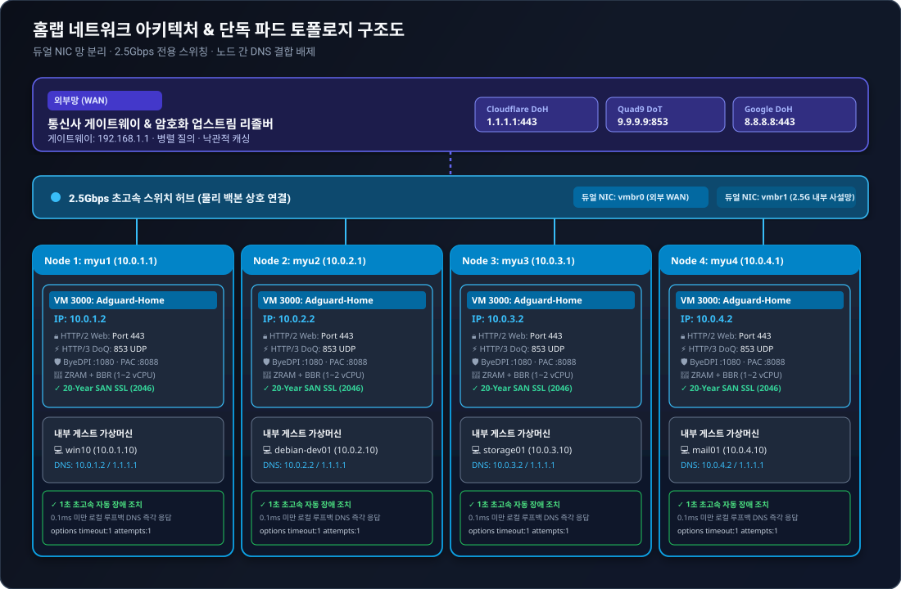

<div align="center">

<p>
  <picture>
    
  </picture>
  <picture>
    
  </picture>
</p>

# AdGuard Home 고성능 홈랩 클러스터 스택

<p>
  <strong>ZRAM(zstd) 메모리 최적화, TCP BBR, HTTP/2 및 HTTP/3(QUIC/DoQ), 멀티 노드 단독 무중단 격리를 적용한 프로덕션급 Zero-SPOF DNS 어플라이언스</strong>
</p>

<p>
  <a href="../README.md">🇺🇸 English</a> ·
  <strong>🇰🇷 한국어</strong> ·
  <a href="zh-CN.md">🇨🇳 中文</a> ·
  <a href="es.md">🇪🇸 Español</a> ·
  <a href="hi.md">🇮🇳 हिन्दी</a><br />
  <a href="ar.md">🇸🇦 العربية</a> ·
  <a href="pt-BR.md">🇧🇷 Português</a> ·
  <a href="ru.md">🇷🇺 Русский</a> ·
  <a href="fr.md">🇫🇷 Français</a> ·
  <a href="id.md">🇮🇩 Bahasa Indonesia</a>
</p>

<p>
  <a href="https://github.com/KS-GG-AI/adguard-homelab/releases"></a>
  <a href="../LICENSE"></a>
  <a href="https://adguard.com/adguard-home.html"></a>
  
  
  
</p>

<p>
  
</p>

</div>

---

<details>
<summary><h2 style="display:inline-block; margin:0;">네트워크 아키텍처: 외부망 vs 내부망 & 2.5G 스위치 허브</h2></summary>

본 스택은 **물리적 망 분리(Physical Segmentation)**와 **무결합 독립 파드 격리(Zero-Coupling Pod Isolation)** 원칙에 따라 설계되어, 신뢰할 수 없는 외부 인터넷 망과 고대역폭 내부 사설망을 완벽히 분리합니다.

<p align="center">
  
</p>

### 1. 🌐 외부망 (WAN / Uplink)
- **ISP 게이트웨이 격리**: 외부 인터넷 및 ISP 공유기(`192.168.1.1`)는 물리 NIC 1(`vmbr0`)을 통해서만 통신하며, 내부 게스트 VM이 공용 인터넷에 무방비로 노출되지 않도록 보호합니다.
- **암호화 업스트림 DNS 연동**: DNS 질의는 평문 UDP 대신 Cloudflare(`1.1.1.1`), Quad9(`9.9.9.9`), Google(`8.8.8.8`)의 DNS-over-HTTPS(DoH) 및 DNS-over-TLS(DoT) 암호화 터널을 통해 전송되어 ISP 감청 및 스누핑을 차단합니다.
- **병렬 질의 & 낙관적 캐싱 (Optimistic Cache)**: 다중 업스트림으로 동시에 질의하여 가장 빠른 응답을 즉시 채택하고, 만료된 레코드도 백그라운드 갱신 중에 0ms로 즉각 응답하여 외부망 지연을 상쇄합니다.

### 2. 🏢 내부망 및 2.5Gbps 스위치 허브 (LAN & Backbone)
- **물리 2.5G 스위치 허브**: 4대의 독립 물리 미니 PC(`myu1`~`myu4`)는 2.5GbE 전용 인터페이스를 통해 2.5G 스위치 허브에 직결되어 물리 PC 간 대역폭 병목 없는 초고속 백본망을 형성합니다.
- **듀얼 NIC 망 분리 (Dual-NIC Segmentation)**:
  - `vmbr0`: 물리 NIC 1에 바인딩되어 외부 WAN 업링크 및 Proxmox 하이퍼바이저 웹 관리망(`192.168.1.0/24`)을 담당합니다.
  - `vmbr1`: 물리 NIC 2에 바인딩되어 내부 전용 사설망(`10.0.X.0/24`)을 구성하며, VM 간 대용량 트래픽이 하이퍼바이저 관리 트래픽을 방해하지 않습니다.
- **노드 간 완전 독립 격리 (Zero Cross-Node Coupling)**:
  - 각 물리 PC는 자체 가상화 환경 내에서 독립된 AdGuard Home 어플라이언스를 **VMID 3000**(`10.0.1.2`, `10.0.2.2`, `10.0.3.2`, `10.0.4.2`)으로 가동합니다.
  - **DNS 클러스터링 배제**: 노드 간 DNS 동기화 및 쿼럼 결합을 일절 배제하여 1번 노드가 점검 또는 재부팅되더라도 2, 3, 4번 노드는 아무런 영향 없이 100% 정상 작동합니다.
- **내부 게스트 고속 통신과 0ms DNS 분리**:
  - 게스트 VM(`win10`, `debian-dev01`, `mail01`, `storage01`) 간 대용량 데이터 전송(Samba, NFS, SSH, DB 복제)은 2.5G 스위치 허브를 통해 최대 2.5Gbps 전송 속도를 모두 활용합니다.
  - DNS 질의는 스위치 허브로 나가지 않고 동일 물리 PC 내의 AdGuard VM(`10.0.X.2:53` UDP)에서 루프백 수준인 **0.1ms 미만**으로 즉각 응답합니다.
- **초고속 1초 장애 조치 (Instant Failover)**:
  - 게스트 VM의 DNS 설정에 1차로 로컬 AdGuard(`10.0.X.2`), 2차로 공용 DNS(`1.1.1.1`)를 등록하고 `options timeout:1 attempts:1`을 적용하여, AdGuard가 꺼져도 1초 만에 공용 DNS로 자동 전환되어 인터넷 중단이 발생하지 않습니다.

</details>

---

<details>
<summary><h2 style="display:inline-block; margin:0;">시스템 사양: 최소 사양 vs 권장 사양</h2></summary>

| 구성 항목 | 최소 사양 (단순 테스트 환경) | 권장 사양 (홈랩 실사용 환경) | 프로덕션 멀티 노드 (실제 검증 완료) |
| :--- | :--- | :--- | :--- |
| **CPU** | 1 vCPU (x86_64 / ARM64) | 1~2 vCPU (x86_64) | Intel N100 / AMD Ryzen 5+ (호스트) |
| **메모리 (RAM)** | 512 MB (ZRAM 활성화) | 1024 MB ~ 2048 MB | 16 GB+ 호스트 (VM당 1024 MB 할당) |
| **메모리 최적화** | 일반 디스크 스왑 | ZRAM (zstd, swappiness 180) | ZRAM 1GB + `page-cluster 0` |
| **스토리지 (디스크)**| 8 GB 가상 디스크 | 16 GB NVMe SSD | PCIe NVMe 고속 SSD |
| **네트워크 (NIC)** | 1x 1Gbps 이더넷 | 2x 1Gbps / 2.5Gbps 듀얼 랜 | 2x 2.5GbE Dual-NIC + 2.5G 스위치 허브 |
| **하이퍼바이저** | Proxmox VE 7+, KVM, ESXi | Proxmox VE 8.x / 베어메탈 | Proxmox VE 8.x 독립 파드 구성 |
| **게스트 OS** | Debian 12 / Ubuntu 22.04 LTS | Debian 12 (커널 6.1 이상) | Debian 12 + TCP BBR + 7.5MB UDP 버퍼 |

</details>

---

<details>
<summary><h2 style="display:inline-block; margin:0;">용도별 사용 가이드</h2></summary>

### 1. 🏡 스마트 홈 및 홈랩 통합 차단 게이트웨이
- 전 기기(스마트폰, PC, 스마트TV, IoT 기기 등)에 앱 설치 없이 공유기/DNS 차원에서 광고, 추적기, 악성코드 유포지를 완벽 차단.

### 2. 💻 개발자 및 엔지니어링 샌드박스
- 내장된 ByeDPI SOCKS5 프록시(`:1080`)와 경량 Python PAC 데몬(`:8088`)을 통해 해외 개발 문서/오픈소스 API를 선별 가속.
- `.local`, `.lab`, `.internal` 등 내부 사설 도메인을 커스텀 DNS 레코드로 등록하여 마이크로서비스 간 편리한 연결 지원.

### 3. 🏛️ 고가용성 가상화 인프라 (Proxmox VE / KVM)
- 노드 간 종속성을 없앤 단독 파드 설계로 특정 물리 머신의 장애가 전체 네트워크 마비로 번지지 않는 무결합 Zero-SPOF 환경 구축.

### 4. 🔒 차세대 엔터프라이즈급 DoQ / HTTP/3 보안 네트워크
- 구형 평문 UDP 53 포트 대신 도청 및 위변조가 불가능한 **DNS-over-QUIC(HTTP/3 UDP 853)** 및 **DNS-over-TLS(TCP 853)** 기본 가동.
- 폐쇄망에서도 갱신 문제없이 동작하는 자동 20년(7,300일) SAN 자체 서명 인증서 및 HTTP/2 웹 관리창(TCP 443) 제공.

</details>

---

<details>
<summary><h2 style="display:inline-block; margin:0;">주요 핵심 기능</h2></summary>

- **⚡ ZRAM zstd 압축 스왑**: 1GB 저용량 VM에서도 디스크 I/O 병목을 제거하는 `swappiness 180`, `page-cluster 0` 기반 1GB 압축 램 드라이브.
- **🚀 커널 네트워크 최적화**: 대용량 DNS 마이크로버스트 패킷 손실을 방지하는 TCP BBR 혼잡 제어, FQ 스케줄러, 7.5MB UDP 수신/송신 버퍼 확장.
- **🔒 네이티브 HTTP/2 및 HTTP/3 (QUIC / DoQ)**: 포트 443(HTTPS) 웹 관리창 HTTP/2 멀티플렉싱 및 포트 853(UDP) 차세대 DNS-over-QUIC(DoQ) 엔진 기본 가동.
- **🛡️ 20년 장기 자체 SSL 인증서**: 외부 도메인이나 90일 주기 갱신 없이 완전한 폐쇄망에서도 영구 동작하는 7,300일 SAN 인증서 자동 발급 스크립트.
- **🔄 투명 80 포트 리다이렉트**: 포트 번호(:3000) 입력 없이 `http://<IP>`로 접속 가능한 iptables 영구 포워딩.

</details>

---

<details>
<summary><h2 style="display:inline-block; margin:0;">디렉터리 구조</h2></summary>

```
├── configs/
│   ├── AdGuardHome.yaml.template     # 실환경 검증 완료된 하드닝 AdGuard 설정
│   ├── sysctl.d/
│   │   └── 99-adhome-tuning.conf     # 커널, BBR, 대용량 소켓 버퍼 튜닝값
│   ├── systemd/
│   │   ├── zram-generator.conf       # ZRAM zstd 스왑 생성기 구성
│   │   ├── byedpi.service            # ByeDPI SOCKS5 프록시 서비스
│   │   └── pac-server.service        # Python PAC 서버 서비스
│   ├── pac/
│   │   ├── pac_server.py             # 초경량 PAC 데몬
│   │   └── proxy.pac.template        # 지능형 라우팅 PAC 템플릿
│   └── iptables/
│       └── rules.v4                  # 80 -> 3000 투명 포트 리다이렉트
├── scripts/
│   ├── setup-node.sh                 # 완전 자동화 노드 배포 스크립트
│   ├── generate-self-signed-cert.sh  # 20년 SAN 자체 서명 인증서 생성기
│   └── verify-health.sh              # 시스템 및 네트워크 상태 점검 유틸리티
├── docs/
│   ├── assets/
│   │   ├── banner.svg                # 고해상도 벡터 타이틀 배너
│   │   ├── network-topology.svg      # 멀티 노드 네트워크 아키텍처 다이어그램
│   │   └── dns-flow.gif              # 실시간 질의 처리 애니메이션 GIF
│   ├── ARCHITECTURE.md               # 상세 멀티 노드 아키텍처 설계서
│   ├── SECURITY.md                   # 보안 경계 및 하드닝 가이드
│   └── PERFORMANCE.md                # ZRAM 및 BBR 벤치마크 기록
├── LICENSE                           # MIT License
└── README.md
```

</details>

---

<details>
<summary><h2 style="display:inline-block; margin:0;">빠른 시작 가이드</h2></summary>

### 1. 사전 요구사항
- 데비안(Debian) 12/13 또는 우분투(Ubuntu) 22.04/24.04 신규 가상머신.
- 권장 규격: 1~2 vCPU, 1024 MB RAM, 16 GB 디스크, 듀얼 NIC(WAN + 내부 2.5G).

### 2. 자동 노드 배포
저장소를 클론하고 노드의 고정 IP를 지정하여 스크립트를 실행합니다:

```bash
git clone https://github.com/KS-GG-AI/adguard-homelab.git
cd adguard-homelab/scripts
chmod +x setup-node.sh generate-self-signed-cert.sh verify-health.sh

# 설치 실행 (지정할 내부 고정 IP 입력)
sudo ./setup-node.sh 10.0.1.2
```

### 3. 상태 및 프로토콜 검증
검증 유틸리티를 실행하여 모든 서비스가 정상인지 확인합니다:

```bash
sudo ./verify-health.sh 10.0.1.2
```

검증 확인 항목:
- **ZRAM**: `/dev/zram0` 장치가 `zstd` 알고리즘으로 활성화되었는지 확인.
- **Sysctl**: `net.ipv4.tcp_congestion_control = bbr`, `vm.swappiness = 180` 확인.
- **Web UI**: `https://10.0.1.2` 접속 시 `HTTP/2 200/302` 응답 확인.
- **DNS**: 포트 53 (UDP), 포트 443 (DoH), 포트 853 (DoT & DoQ / HTTP/3) 리스닝 확인.

</details>

---

<details>
<summary><h2 style="display:inline-block; margin:0;">보안 감사 및 무결성 정책</h2></summary>

- **시크릿 유출 제로**: 모든 비밀번호, bcrypt 해시, 개인키는 레포지토리에서 완전히 제거되었으며 안전한 템플릿으로 제공됩니다.
- **완전 폐쇄망 지원**: 20년 장기 인증서 발급으로 외부 인증기관 갱신 통신 없이 영구 자립 동작합니다.
- **노드 간 상호 결합 제로**: 쿼럼 결합 없는 독립 노드 설계로 단일 머신 장애 시 피해가 확산되지 않습니다.

</details>

---

<details>
<summary><h2 style="display:inline-block; margin:0;">라이선스</h2></summary>

본 프로젝트는 [MIT 라이선스](../LICENSE) 하에 배포됩니다.

</details>

---

<details>
<summary><h2 style="display:inline-block; margin:0;">📬 연락</h2></summary>

공개 작업, 피드백, 구현 내용을 더 살펴보려면 아래 경로가 가장 빠릅니다.

[GitHub 프로필](https://github.com/KS-GG-AI) · [공개 저장소](https://github.com/KS-GG-AI?tab=repositories) · [이슈 열기](https://github.com/KS-GG-AI/adguard-homelab/issues/new) · [프로필 소스](https://github.com/KS-GG-AI/KS-GG-AI)

</details>
