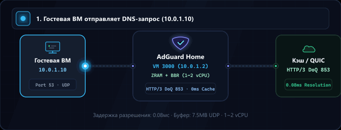
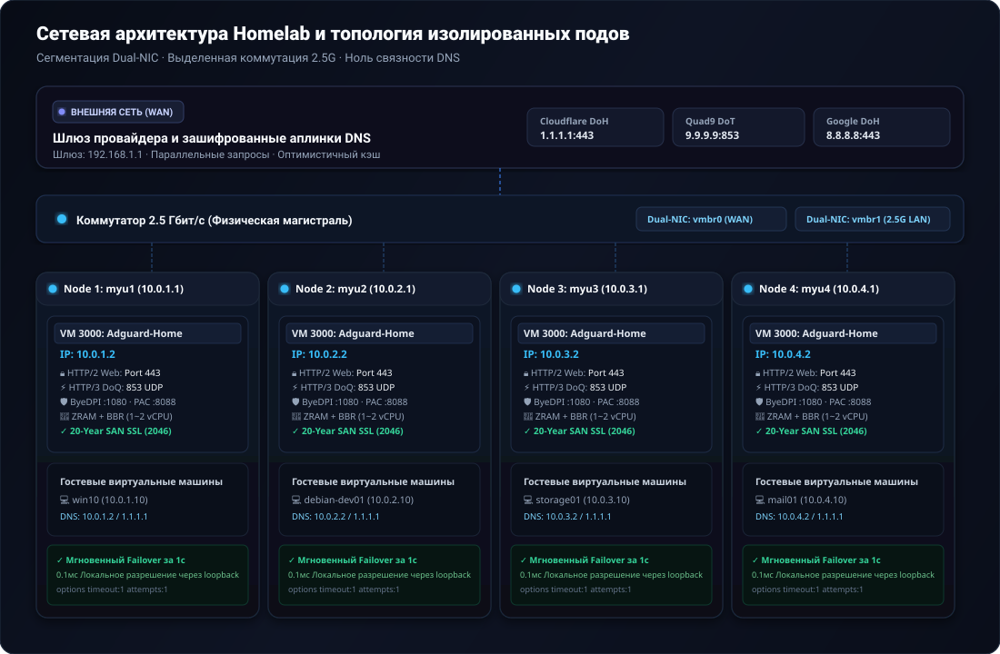

<div align="center">

<p>
  <picture>
    
  </picture>
  <picture>
    
  </picture>
</p>

# AdGuard Home: Высокопроизводительный стек для Homelab

<p>
  <strong>Сетевой и DNS-программно-аппаратный комплекс уровня Production Zero-SPOF с оптимизацией ZRAM (zstd), TCP BBR, HTTP/2 и HTTP/3 (QUIC/DoQ) и изолированной многоузловой устойчивостью.</strong>
</p>

<p>
  <a href="../README.md">🇺🇸 English</a> ·
  <a href="ko.md">🇰🇷 한국어</a> ·
  <a href="zh-CN.md">🇨🇳 中文</a> ·
  <a href="es.md">🇪🇸 Español</a> ·
  <a href="hi.md">🇮🇳 हिन्दी</a><br />
  <a href="ar.md">🇸🇦 العربية</a> ·
  <a href="pt-BR.md">🇧🇷 Português</a> ·
  <strong>🇷🇺 Русский</strong> ·
  <a href="fr.md">🇫🇷 Français</a> ·
  <a href="id.md">🇮🇩 Bahasa Indonesia</a>
</p>

<p>
  <a href="https://github.com/KS-GG-AI/adguard-homelab/releases"></a>
  <a href="../LICENSE"></a>
  <a href="https://adguard.com/adguard-home.html"></a>
  
  
  
</p>

<p>
  
</p>

</div>

---

<details>
<summary><h2 style="display:inline-block; margin:0;">Сетевая архитектура: Внешняя сеть vs Внутренняя сеть & Коммутатор 2.5G</h2></summary>

Данная архитектура построена на принципах **строгой физической сегментации** и **полной изоляции независимых узлов (Zero-Coupling Pod Isolation)**, надежно отделяя ненадежный внешний интернет (WAN) от высокоскоростного внутреннего трафика (LAN).

<p align="center">
  
</p>

### 1. 🌐 Внешняя сеть (WAN / Аплинк)
- **Изоляция шлюза провайдера (ISP)**: Внешняя сеть и роутер провайдера (192.168.1.1) подключены исключительно через vmbr0 (интерфейс управления и аплинка), предотвращая прямой доступ из интернета к гостевым виртуальным машинам.
- **Зашифрованное вышестоящее DNS-разрешение**: Запросы DNS отправляются через защищенные туннели DNS-over-HTTPS (DoH) и DNS-over-TLS (DoT) на серверы Cloudflare (1.1.1.1), Quad9 (9.9.9.9) и Google (8.8.8.8), исключая прослушивание провайдером.
- **Параллельные запросы и оптимистичное кэширование**: Параллельный опрос вышестоящих серверов с мгновенным кэшированием в оперативной памяти позволяет отдавать ответы за 0 мс даже при сбоях внешнего канала.

### 2. 🏢 Внутренняя сеть и коммутатор 2.5 Гбит/с (LAN & Магистраль)
- **Физический коммутатор 2.5G**: 4 независимых физических мини-ПК (myu1~myu4) соединены выделенными портами 2.5GbE через скоростной коммутатор, формируя неблокирующую аппаратную магистраль.
- **Сегментация с двумя сетевыми картами (Dual-NIC)**: vmbr0 привязан к физической сетевой карте 1 для WAN-трафика и веб-управления Proxmox (192.168.1.0/24); vmbr1 привязан к карте 2 для внутренней изолированной сети (10.0.X.0/24), исключая взаимное влияние трафика.
- **Строгая изоляция независимых узлов (Без межузловой связи)**: Каждый физический сервер запускает собственный изолированный AdGuard Home на VMID 3000 (10.0.X.2). Отсутствие DNS-кластеризации: перезагрузка узла 1 никак не влияет на 100% работоспособность узлов 2, 3 и 4.
- **Высокоскоростная связь между ВМ и мгновенный DNS за 0 мс**: Передача больших файлов между гостевыми ВМ (Samba, NFS, SSH, СУБД) использует полную скорость 2.5 Гбит/с. Запросы DNS обрабатываются локально на том же сервере (10.0.X.2:53 UDP) с задержкой loopback менее 0.1 мс.
- **Мгновенное переключение при сбое за 1 секунду (Instant Failover)**: В сетевых настройках гостевых ВМ задан основной DNS 10.0.X.2 и резервный публичный DNS 1.1.1.1 с параметрами options timeout:1 attempts:1. При остановке AdGuard трафик за 1 секунду переключается на резерв без разрыва соединений.

</details>

---

<details>
<summary><h2 style="display:inline-block; margin:0;">Системные требования: Минимальные vs Рекомендуемые</h2></summary>

| Компонент | Минимальные требования (Базовый тест) | Рекомендуемые требования (Homelab Production) | Корпоративный мульти-узел (Протестировано) |
| :--- | :--- | :--- | :--- |
| **Процессор (CPU)** | 1 vCPU (x86_64 или ARM64) | 1 ~ 2 vCPU (x86_64) | Intel N100 / AMD Ryzen 5+ (Физический хост) |
| **Память (RAM)** | 512 МБ (с ZRAM) | 1024 МБ ~ 2048 МБ | 16 ГБ+ Хост (выделено 1024 МБ на каждую ВМ) |
| **Оптимизация памяти** | Стандартный swap на диске | ZRAM (zstd, swappiness 180) | ZRAM 1ГБ + page-cluster 0 |
| **Диск (Storage)** | 8 ГБ виртуальный диск | 16 ГБ NVMe SSD | Высокоскоростной накопитель PCIe NVMe |
| **Сеть (NIC)** | 1x 1Gbps Ethernet | 2x 1Gbps или 2.5Gbps Dual-NIC | 2x 2.5GbE Dual-NIC + коммутатор 2.5G |
| **Гипервизор** | Proxmox VE 7+, KVM, ESXi | Proxmox VE 8.x / Bare Metal | Автономные поды Proxmox VE 8.x |
| **ОС гостя** | Debian 12 / Ubuntu 22.04 LTS | Debian 12 (Ядро 6.1+) | Debian 12 + TCP BBR + 7.5МБ UDP |

</details>

---

<details>
<summary><h2 style="display:inline-block; margin:0;">Сценарии использования по назначению</h2></summary>

### 1. 🏡 Защитный шлюз для Умного дома и Homelab
- Централизованная блокировка рекламы, телеметрии и вредоносного ПО без установки приложений для Smart TV, смартфонов, IoT-устройств и консолей.

### 2. 💻 Песочница для инженеров и разработчиков
- Встроенный прокси ByeDPI SOCKS5 (:1080) и легковесный Python PAC-сервер (:8088) для избирательного ускорения внешних API и документации с поддержкой доменов .local, .lab и .internal.

### 3. 🏛️ Отказоустойчивая виртуализация (Proxmox VE / KVM)
- Архитектура автономных узлов исключает каскадные сбои: плановое обслуживание одного хоста не прерывает работу сети остальных серверов.

### 4. 🔒 Зашифрованный транспорт нового поколения (DoQ / HTTP/3 и DoT)
- Отказ от открытого протокола UDP 53 в пользу DNS-over-QUIC (HTTP/3 UDP 853) и DNS-over-TLS (TCP 853) с веб-панелью HTTP/2 и сертификатами SAN на 20 лет.

</details>

---

<details>
<summary><h2 style="display:inline-block; margin:0;">Ключевые особенности производительности</h2></summary>

- **⚡ Сжатый swap ZRAM с алгоритмом zstd**: 1 ГБ сжатый RAM-диск с swappiness 180 и page-cluster 0 устраняет задержки дискового ввода-вывода.
- **🚀 Оптимизация сетевого стека ядра**: Контроль перегрузки TCP BBR, планировщик FQ и увеличенные буферы сокетов UDP до 7.5 МБ (rmem_max/wmem_max) для обработки пиковых нагрузок.
- **🔒 Нативная поддержка HTTP/2 и HTTP/3 (QUIC / DoQ)**: Веб-интерфейс работает по HTTP/2 на порту 443; модуль DNS-over-QUIC обслуживает запросы на порту 853 UDP.
- **🛡️ Автоматические сертификаты TLS со сроком действия 20 лет**: Скрипт генерирует SAN-сертификаты со сроком действия 7 300 дней до 2046 года без необходимости внешнего продления.
- **🔄 Прозрачный редирект с порта 80**: Постоянное правило iptables NAT перенаправляет порт HTTP 80 на порт 3000, избавляя от необходимости указывать порт в браузере.

</details>

---

<details>
<summary><h2 style="display:inline-block; margin:0;">Структура каталогов</h2></summary>

```
├── configs/
│   ├── AdGuardHome.yaml.template     # Sanitized, production-tuned AdGuard config
│   ├── sysctl.d/
│   │   └── 99-adhome-tuning.conf     # Kernel, BBR, and socket buffer tuning
│   ├── systemd/
│   │   ├── zram-generator.conf       # ZRAM zstd generator configuration
│   │   ├── byedpi.service            # ByeDPI SOCKS5 systemd service
│   │   └── pac-server.service        # Python PAC server systemd service
│   ├── pac/
│   │   ├── pac_server.py             # Lightweight PAC HTTP daemon
│   │   └── proxy.pac.template        # Smart routing PAC file template
│   └── iptables/
│       └── rules.v4                  # Persistent Port 80 -> 3000 NAT redirect
├── scripts/
│   ├── setup-node.sh                 # Full automated installation script
│   ├── generate-self-signed-cert.sh  # 20-Year SAN SSL certificate generator
│   └── verify-health.sh              # System & network health check utility
├── docs/
│   ├── assets/
│   │   ├── banner.svg                # High-resolution vector banner
│   │   ├── network-topology.svg      # Multi-node network topology diagram
│   │   └── dns-flow.gif              # Real-time resolution flow animation
│   ├── ARCHITECTURE.md               # Detailed multi-node architectural design
│   ├── SECURITY.md                   # Security boundary & hardening guide
│   └── PERFORMANCE.md                # ZRAM & BBR benchmark documentation
├── LICENSE                           # MIT License
└── README.md
```

</details>

---

<details>
<summary><h2 style="display:inline-block; margin:0;">Руководство по быстрому старту</h2></summary>

### 1. Предварительные требования
- Чистая виртуальная машина Debian 12 / 13 или Ubuntu 22.04 / 24.04.
- Рекомендуемые характеристики: 1 vCPU, 1024 МБ RAM, 16 ГБ диск, две сетевые карты (WAN + LAN 2.5G).

### 2. Автоматизированное развертывание узла
```bash
git clone https://github.com/KS-GG-AI/adguard-homelab.git
cd adguard-homelab/scripts
chmod +x setup-node.sh generate-self-signed-cert.sh verify-health.sh

# Запуск скрипта установки (с указанием внутреннего статического IP)
sudo ./setup-node.sh 10.0.1.2
```

### 3. Проверка состояния и протоколов
```bash
sudo ./verify-health.sh 10.0.1.2
```

- **ZRAM**: Проверить активность /dev/zram0 со сжатием zstd.
- **Sysctl**: Убедиться в параметрах net.ipv4.tcp_congestion_control = bbr и vm.swappiness = 180.
- **Web UI**: Получение ответа HTTP/2 200/302 при переходе на https://10.0.1.2.
- **DNS**: Порты 53 (UDP), 443 (DoH) и 853 (DoT & DoQ / HTTP/3) находятся в активном режиме прослушивания.

</details>

---

<details>
<summary><h2 style="display:inline-block; margin:0;">Аудит безопасности и соответствие стандартам</h2></summary>

- **Ноль жестко заданных секретов**: Все пароли, хэши bcrypt и закрытые ключи удалены и заменены безопасными шаблонами конфигурации.
- **Готовность к полностью изолированным сетям (Air-Gapped)**: Сертификаты на 20 лет работают без подключения к внешним API продления.
- **Отсутствие связности между узлами**: Каждый физический сервер функционирует автономно без общего кворума.

</details>

---

<details>
<summary><h2 style="display:inline-block; margin:0;">Лицензия</h2></summary>

Распространяется под лицензией [MIT](../LICENSE).

</details>

---

<details>
<summary><h2 style="display:inline-block; margin:0;">📬 Контакты</h2></summary>

Для вопросов по публичным проектам, обратной связи или детального ознакомления с реализацией лучше всего использовать эти ссылки.

[Профиль GitHub](https://github.com/KS-GG-AI) · [Публичные репозитории](https://github.com/KS-GG-AI?tab=repositories) · [Создать issue](https://github.com/KS-GG-AI/adguard-homelab/issues/new) · [Исходный код профиля](https://github.com/KS-GG-AI/KS-GG-AI)

</details>
