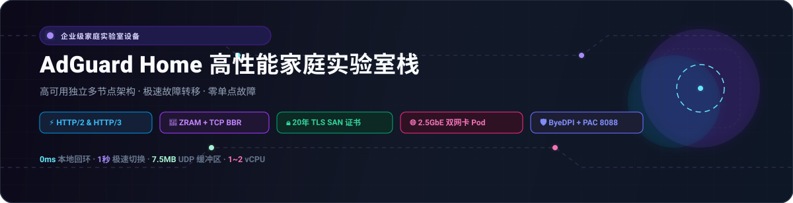
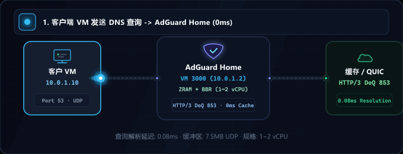
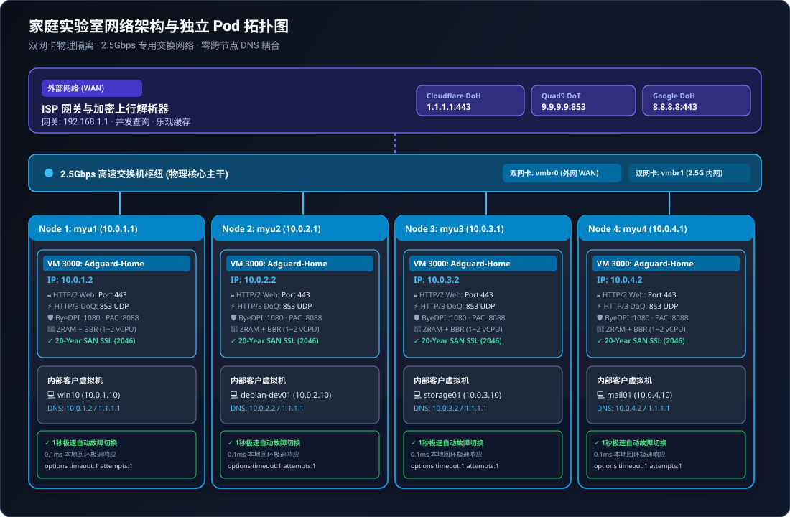

<div align="center">

<picture>
  
</picture>

# AdGuard Home 高性能家庭实验室集群套件

<p>
  <strong>基于 ZRAM (zstd) 内存优化、TCP BBR、HTTP/2 与 HTTP/3 (QUIC/DoQ) 及多物理节点独立无中断隔离的生产级 Zero-SPOF DNS 网络硬件解决方案</strong>
</p>

<p>
  <a href="../README.md">🇺🇸 English</a> ·
  <a href="ko.md">🇰🇷 한국어</a> ·
  <strong>🇨🇳 中文</strong> ·
  <a href="es.md">🇪🇸 Español</a> ·
  <a href="hi.md">🇮🇳 हिन्दी</a><br />
  <a href="ar.md">🇸🇦 العربية</a> ·
  <a href="pt-BR.md">🇧🇷 Português</a> ·
  <a href="ru.md">🇷🇺 Русский</a> ·
  <a href="fr.md">🇫🇷 Français</a> ·
  <a href="id.md">🇮🇩 Bahasa Indonesia</a>
</p>

<p>
  <a href="https://github.com/KS-GG-AI/adguardhome-homelab-stack/releases"></a>
  <a href="../LICENSE"></a>
  <a href="https://adguard.com/adguard-home.html"></a>
  
  
  
</p>

<p>
  
</p>

</div>

---

## 网络架构：外网 vs 内网 & 2.5G 交换机枢纽

本架构遵循**物理网络分流 (Physical Segmentation)**与**零耦合独立节点隔离 (Zero-Coupling Pod Isolation)**原则，彻底隔绝不可信外部网络与高带宽内网私有通信。

<p align="center">
  
</p>

### 🌐 外部网络 (WAN / 上行链路)
- **ISP 网关严格隔离**: 外部网络与运营商光猫 (192.168.1.1) 仅连接至 vmbr0 管理口，确保内网虚拟机不会直接暴露至公网。
- **加密上行 DNS 解析**: 上行 DNS 查询经由 DNS-over-HTTPS (DoH) 与 DNS-over-TLS (DoT) 发往 Cloudflare (1.1.1.1)、Quad9 (9.9.9.9) 及 Google (8.8.8.8)，阻断运营商劫持与监听。
- **并行查询与乐观缓存**: 多上行并发解析并秒级存储于内存缓存，即使外部公网瞬间抖动，也能以 0ms 瞬间响应已知记录。

### 🏢 内部网络与 2.5Gbps 交换机 (LAN & 核心主干)
- **物理 2.5G 交换机核心**: 4 台独立物理迷你主机 (myu1~myu4) 通过 2.5GbE 网口直连 2.5G 交换机，打造无任何带宽瓶颈的千兆内网主干。
- **双网卡网络隔离**: vmbr0 绑定物理网卡 1 处理 WAN 上行与 Proxmox 管理；vmbr1 绑定物理网卡 2 处理 10.0.X.0/24 私网传输，大文件传输互不干扰。
- **严格节点独立 (零跨节点依赖)**: 每台物理机独立运行专属 AdGuard VM (VMID 3000: 10.0.X.2)，绝不跨节点做 DNS 集群同步，某台主机重启维护绝不波及其他主机。
- **虚拟机高速内网与 0ms DNS 解析**: 虚拟机间的大容量文件传输 (Samba, NFS, SSH) 跑满 2.5Gbps 线速；DNS 查询直接在同主机内以 0.1ms 回环极速完成。
- **极速 1 秒自动故障切换**: 客户端配置主 DNS (10.0.X.2) 与备用公共 DNS (1.1.1.1)，并启用 options timeout:1 attempts:1，AdGuard 停机时 1 秒无缝切至备用。

---

## 硬件规格要求：最低 vs 推荐配置

| 规格组件 | 最低配置要求 (基础测试环境) | 推荐生产规格 (家庭核心实验室) | 企业级多节点规格 (实测验证) |
| :--- | :--- | :--- | :--- |
| **CPU** | 1 vCPU (x86_64 / ARM64) | 1 ~ 2 vCPU (x86_64) | Intel N100 / AMD Ryzen 5+ (物理宿主) |
| **内存 (RAM)** | 512 MB (需开启 ZRAM) | 1024 MB ~ 2048 MB | 16 GB+ 物理内存 (每 VM 分配 1GB) |
| **内存优化** | 常规磁盘交换 | ZRAM (zstd, swappiness 180) | ZRAM 1GB + page-cluster 0 |
| **存储空间** | 8 GB 虚拟磁盘 | 16 GB NVMe SSD | PCIe 3.0/4.0 高速 NVMe |
| **网卡 (NIC)** | 1x 1Gbps 千兆以太网 | 2x 1Gbps 或 2.5Gbps 双网卡 | 2x 2.5GbE 双网卡 + 2.5G 交换机 |
| **虚拟化平台** | Proxmox VE 7+, KVM, ESXi | Proxmox VE 8.x / 裸金属 | Proxmox VE 8.x 独立 Pod 架构 |
| **系统镜像** | Debian 12 / Ubuntu 22.04 LTS | Debian 12 (Kernel 6.1+) | Debian 12 + TCP BBR + 7.5MB UDP |

---

## 典型应用场景

### 🏡 全屋智能家居与全域广告拦截
- 无需在电视、手机、IoT 设备上安装客户端，在网关和 DNS 层面统合拦截全网广告与恶意追踪。

### 💻 开发者与工程实验沙盒
- 内置 ByeDPI SOCKS5 (:1080) 与 Python PAC (:8088)，加速海外文档与 API，支持 .local, .lab 等内网私有域名解析。

### 🏛️ 高可用虚拟化集群 (Proxmox VE / KVM)
- 消除跨节点依赖的独立节点架构，任何单机维护不会造成局域网全网断网。

### 🔒 次世代 DoQ / HTTP/3 企业安全 DNS
- 抛弃传统明文 UDP 53，默认启用 DNS-over-QUIC (853 UDP) 与 HTTP/2 Web UI，配套 20 年长效 SAN 证书。

---

## 核心性能特性

- **⚡ ZRAM zstd 内存压缩交换**: 1GB 压缩 RAM 驱动器，配合 swappiness 180 与 page-cluster 0 消除磁盘 I/O 瓶颈。
- **🚀 内核网络协议栈调优**: 启用 TCP BBR、FQ 队列及 7.5MB UDP 套接字缓冲区，稳定吞吐高并发 DNS 微突发。
- **🔒 原生 HTTP/2 与 HTTP/3 (QUIC / DoQ)**: Web 后台支持 443 端口 HTTP/2；853 端口默认运行 DNS-over-QUIC。
- **🛡️ 20 年自动化自签证书**: 脚本自动生成有效期至 2046 年的 7,300 天 SAN 证书，零外部依赖，完全适配离线网络。
- **🔄 80 端口透明重定向**: 通过持久化 iptables NAT 规则自动将 80 端口导流至 3000。

---

## 目录组织结构

```
├── configs/
│   ├── AdGuardHome.yaml.template     # Sanitized, production-tuned AdGuard config
│   ├── sysctl.d/
│   │   └── 99-adhome-tuning.conf     # Kernel, BBR, and socket buffer tuning
│   ├── systemd/
│   │   ├── zram-generator.conf       # ZRAM zstd generator configuration
│   │   ├── byedpi.service            # ByeDPI SOCKS5 systemd service
│   │   └── pac-server.service        # Python PAC server systemd service
│   ├── pac/
│   │   ├── pac_server.py             # Lightweight PAC HTTP daemon
│   │   └── proxy.pac.template        # Smart routing PAC file template
│   └── iptables/
│       └── rules.v4                  # Persistent Port 80 -> 3000 NAT redirect
├── scripts/
│   ├── setup-node.sh                 # Full automated installation script
│   ├── generate-self-signed-cert.sh  # 20-Year SAN SSL certificate generator
│   └── verify-health.sh              # System & network health check utility
├── docs/
│   ├── assets/
│   │   ├── banner.svg                # High-resolution vector banner
│   │   ├── network-topology.svg      # Multi-node network topology diagram
│   │   └── dns-flow.gif              # Real-time resolution flow animation
│   ├── ARCHITECTURE.md               # Detailed multi-node architectural design
│   ├── SECURITY.md                   # Security boundary & hardening guide
│   └── PERFORMANCE.md                # ZRAM & BBR benchmark documentation
├── LICENSE                           # MIT License
└── README.md
```

---

## 快速上手指南

### 1. 前置环境准备
- 全新 Debian 12 / 13 或 Ubuntu 22.04 / 24.04 虚拟机。
- 推荐规格：1 ~ 2 vCPU, 1024 MB RAM, 16 GB 磁盘, 双网卡 (WAN + 内网 2.5G)。

### 2. 自动化节点安装部署
```bash
git clone https://github.com/KS-GG-AI/adguardhome-homelab-stack.git
cd adguardhome-homelab-stack/scripts
chmod +x setup-node.sh generate-self-signed-cert.sh verify-health.sh

# 执行安装脚本（输入指定节点的静态 IP）
sudo ./setup-node.sh 10.0.1.2
```

### 3. 健康状态与协议验证
```bash
sudo ./verify-health.sh 10.0.1.2
```

- **ZRAM**: 验证 /dev/zram0 已加载并采用 zstd 压缩算法。
- **Sysctl**: 验证 net.ipv4.tcp_congestion_control = bbr 与 vm.swappiness = 180。
- **Web UI**: https://10.0.1.2 正常返回 HTTP/2 200/302 响应。
- **DNS 监听**: 端口 53 (UDP), 443 (DoH), 853 (DoT & DoQ / HTTP/3) 均处于正常监听状态。

---

## 安全审计与合规声明

- **零硬编码机密**: 所有密码、bcrypt 散列与私钥均已脱敏，仅提供配置模板。
- **纯内网离线支持**: 20 年长效证书无需任何外部 90 天证书续签 API 通信。
- **零跨节点耦合**: 单台宿主机重启绝不影响其他主机的 DNS 解析能力。

---

## 开源许可证

本项目在 [MIT 许可证](../LICENSE) 下开源发布。
